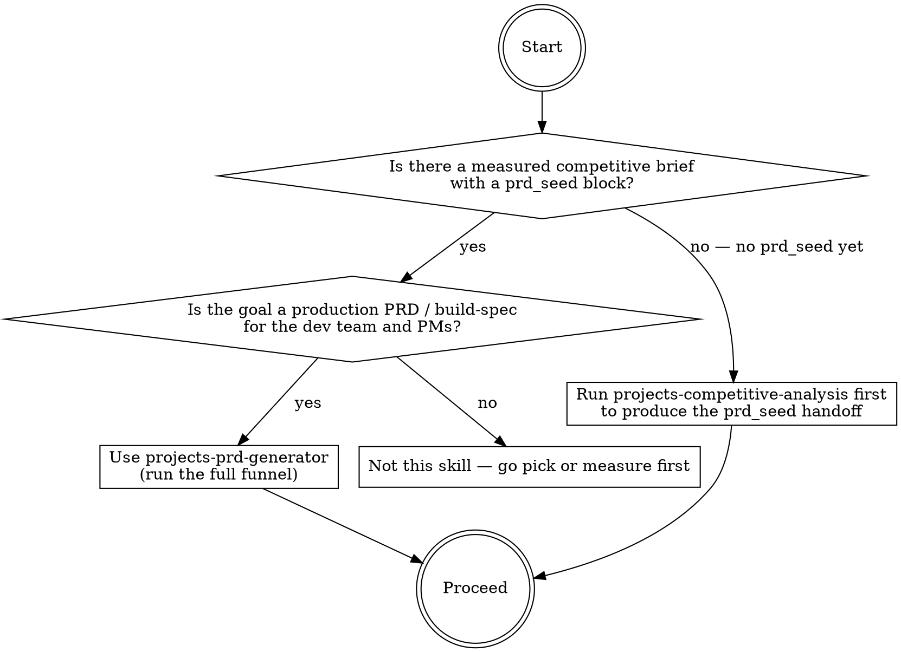
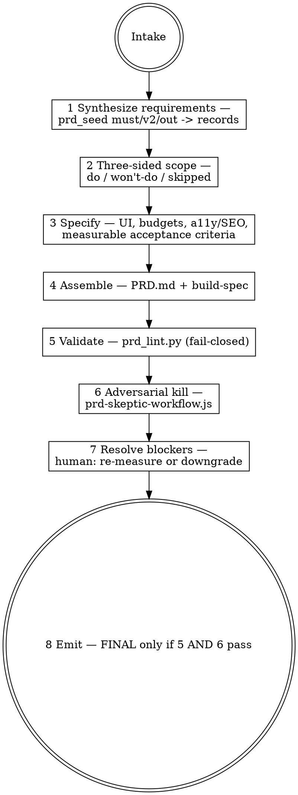

# projects-prd-generator

## Overview

Converts a measured competitive brief — specifically the frozen `prd_seed` handoff block produced by `projects-competitive-analysis` — into a single-source-of-truth Product Requirements Document plus a machine-readable `build-spec` the dev team and project managers build from. This is the third stage of the house pipeline: `pick-next-tool` (what to build) then `projects-competitive-analysis` (why we win) then this skill (the buildable contract). The same discipline carries through — evidence tiers, fail-closed gates, an adversarial kill pass. A PRD that reads well but rests a requirement on an unverified hunch, states an unmeasurable goal, or hides its non-goals is the exact failure this skill makes structurally impossible.

## When to use



## IRON LAWS

```
1. NO REQUIREMENT WITHOUT A SOURCE — every requirement traces to a brief-ledger
   entry, a pick-next-tool datum, or is tagged ASSUMPTION with an owner.
   An untraceable requirement is cut.

2. NO UNVERIFIED CLAIM AS A v1 MUST-HAVE — reasoned / UNVERIFIED / HYPOTHESIS
   evidence may enter the PRD ONLY as a v2 item or a tracked open question,
   never as a v1 requirement.

3. EVERY ACCEPTANCE CRITERION IS MEASURABLE — number + unit + how-to-verify,
   or it is not a criterion. "Fast" / "accessible" / "clean" / "intuitive"
   without a measured target is illegal.

4. SCOPE IS THREE-SIDED — every PRD states DO (in-scope), WON'T-DO (explicit
   non-goals), and SKIPPED-FOR-NOW (deferred, with reason). A feature present
   in none of the three is a gap -> fail.

5. THE VALIDATOR FAILS CLOSED — a missing required section, an untraceable
   requirement, an unmeasurable criterion, or a PRD<->build-spec mismatch makes
   prd_lint raise; the PRD is stamped DRAFT-INCOMPLETE and FINAL is refused.
   "Insufficient input" is a legal output.

6. THE "COMPLETE" STAMP COMES FROM THE ENGINE + SKEPTIC — declaring a PRD
   complete without prd_lint PASS + the adversarial pass is a skill failure.
```

Violating the letter of these laws is violating the spirit. A goal of "be the best calculator" (unmeasurable), a must-have built on a HYPOTHESIS gap, or a PRD with no non-goals section is a violation.

## The funnel



## Inputs

Reads the tool's build folder (`micro-tool-factory/builds/<tool>/`). The `prd_seed:` YAML block in `COMPETITIVE-BRIEF*.md` is the **spine** — refuse to run without it ("run projects-competitive-analysis first"). Also pulls the full brief + source ledger (`research-raw*.json`, `audit-measured.json`, `gaps.json`), the `pick-next-tool` `research-raw.json` (demand / keywords), and the product gist. Every fact carries its upstream evidence tier (`real-measured` > `triangulated` > `reasoned`/`UNVERIFIED`/`HYPOTHESIS`); the tier governs IRON LAW 2.

## Gap handling — tiered gate + assumption register

- Hard-BLOCK only when a v1 **must-have** rests on no evidence or a weak tier.
- All other uncertainty (launch-time rechecks, unmeasured demand on v2 / nice-to-haves) is **quarantined** into the Assumptions and Open Questions register with an owner + resolve-by — the PRD still ships complete.
- On a hard-block the skill STOPS and offers the human a choice: re-measure (re-invoke the upstream skill) or downgrade the requirement to v2 / non-goal. Never auto-run live measurement.

## Mandatory checklist

Announce: **"Using projects-prd-generator to write the PRD for [tool]."** Create a TodoWrite item for EACH stage and complete them in order. Do not advance until the current stage is PASS.

```
0. Intake — confirm build folder + tool; load prd_seed + brief + ledger +
   pick-next-tool research + gist; record every inherited evidence tier.

1. Synthesize requirements — map prd_seed must_have / v2 / out_of_scope into
   requirement records {id, statement, priority, source_ref, evidence_tier,
   acceptance_criteria[]}. One record per requirement.

2. Three-sided scope — classify every candidate feature into DO / WON'T-DO /
   SKIPPED-FOR-NOW, each with a one-line reason. Nothing left unclassified.

3. Specify — UI/UX spec; performance budget (LCP/CLS/INP numbers); a11y target
   (WCAG level + Lighthouse score); SEO / schema targets; monetization ceiling;
   north-star goal + success metrics; measurable acceptance criteria, each with
   the competitor baseline to beat or match.

4. Assemble — fill references/prd-template.md (14 sections); produce the machine
   build-spec.json + build-spec.yaml as a literal projection of the records.

5. Validate (engine) — run scripts/prd_lint.py on PRD.md + build-spec.json.
   Fail-closed. Paste the literal PASS/FAIL + violation list. No FINAL on FAIL.

6. Adversarial kill (skeptic) — invoke scripts/prd-skeptic-workflow.js via the
   Workflow tool; it challenges every requirement, criterion, and non-goal and
   returns blocking vs advisory verdicts. BLOCKING is an OBJECTIVE defect — not
   traceable, not measurable, wrong scope, or an internal contradiction — and
   bounces back to stages 1-3. ADVISORY (a flag or demote raised only for a
   missing edge case, with all hard gates green and no contradiction) is folded
   into the PRD as an added acceptance criterion and does NOT block FINAL —
   blocking on every conceivable edge case never converges. FINAL requires
   prd_lint PASS and skeptic blocking == 0.

7. Resolve blockers — for each hard-block, surface to the human: re-measure via
   the upstream skill, or downgrade. Apply the choice and re-run stages 5-6.

8. Emit — write PRD.md (FINAL only if 5 AND 6 pass; else DRAFT-INCOMPLETE) +
   build-spec.{json,yaml} + prd-trace.md. If a PRD.md already exists in the build
   folder, write PRD-<version>-generated.md instead and note supersession — never
   silently overwrite a prior PRD. Print the handoff summary.
```

## Quick reference: the 14 PRD sections

Full template: `references/prd-template.md`. The engine's `REQUIRED_SECTIONS` must match these headers exactly (drift is caught automatically — a PRD built from the template is linted by the engine).

| # | Section | Source |
|---|---------|--------|
| 1 | Exec Summary | prd_seed.positioning + differentiation_moat |
| 2 | Goal & Success Metrics | prd_seed.target_cluster + analyst |
| 3 | Background & Evidence | brief summary + refuted assumptions |
| 4 | Personas & Jobs-to-be-Done | prd_seed.jobs_to_be_done |
| 5 | Scope | prd_seed must/v2/out, three-sided |
| 6 | Functional Requirements | stage-1 records |
| 7 | UI/UX Spec | analyst + brief UX teardown |
| 8 | Benchmarks | prd_seed budgets + audit baselines |
| 9 | Monetization & Constraints | prd_seed.monetization_notes |
| 10 | Analytics & Instrumentation | analyst from section 2 |
| 11 | Assumptions & Open Questions | prd_seed.open_questions + weak tiers |
| 12 | Risks & Mitigations | brief Risks + analyst |
| 13 | Milestones / Definition of Done | launch gate |
| 14 | Traceability Appendix | requirement -> source map |

## Quick reference: the engine + skeptic

- **`scripts/prd_lint.py`** — the fail-closed validator. Deep checks (traceability, tier-gating, measurability, three-sided scope) run on the structured `build-spec.json`; PRD.md is checked for section presence + requirement-id agreement. `python3 scripts/prd_lint.py --selftest` proves it (golden-good + 8 golden-bad fixtures + structural invariant).
- **`scripts/prd-skeptic-workflow.js`** — one adversarial skeptic per requirement, schema-validated verdicts. Default-to-skeptical.

## How to run

1. Run the funnel stages 0-4 to produce `PRD.md` + `build-spec.json` + `build-spec.yaml`.
2. `python3 scripts/prd_lint.py builds/<tool>/PRD.md builds/<tool>/build-spec.json` — paste the literal output. PASS required.
3. Invoke `scripts/prd-skeptic-workflow.js` via the Workflow tool with `{scriptPath, args:{build_spec: <the build-spec object>}}`. Do not read the workflow into context to study it — execute it.
4. Resolve any blocker (stage 7), then write deliverables per `references/deliverables.md` and print the handoff.

## Common rationalizations — STOP

| Excuse | Reality |
|--------|---------|
| "The goal is obviously to be fast." | "Fast" is illegal — write `LCP <= 1100 ms` with the competitor baseline, or it is cut. |
| "This must-have is probably fine." | If its evidence tier is weak it is a v2 item or an open question, never a v1 requirement (IRON LAW 2). |
| "I don't need to list non-goals." | A PRD with no WON'T-DO section fails the engine (IRON LAW 4). |
| "The requirement is obvious, no source needed." | Untraceable requirement = cut. Cite the ledger entry or tag ASSUMPTION + owner. |
| "It reads complete to me." | A "complete" stamp without prd_lint PASS + skeptic PASS is a skill failure (IRON LAW 6). |
| "The open question is minor, I'll drop it." | Quarantine it in the register with an owner — dropping it hides risk. |
| "I'll just hand-write the build-spec to match." | The build-spec is a literal projection of the records; `check_agreement` fails on drift. |

## Red flags — you are rationalizing, start over

- An acceptance criterion with no number and no boolean predicate -> rewrite it measurably; back to stage 3.
- A v1 must-have whose evidence tier is reasoned / UNVERIFIED / HYPOTHESIS -> demote to v2 / open question; back to stage 1.
- Scope with no WON'T-DO or no SKIPPED list -> classify every feature three ways; back to stage 2.
- You stamped FINAL without pasting prd_lint PASS and the skeptic result -> back to stages 5-6.
- The PRD requirement ids do not match build-spec ids -> reconcile; the engine will fail closed.
- No prd_seed in the build folder -> stop; run projects-competitive-analysis first.

## Reference files

- `references/prd-template.md` — the 14-section PRD template (canonical headers).
- `references/requirement-rubric.md` — what makes a requirement well-formed + traceable.
- `references/scope-rubric.md` — how to classify do / won't-do / skipped.
- `references/acceptance-criteria-guide.md` — measurable-criteria patterns + banned adjectives.
- `references/deliverables.md` — PRD.md / build-spec / prd-trace.md templates + handoff format.
- `docs/adr/` — the five architecture decision records.
