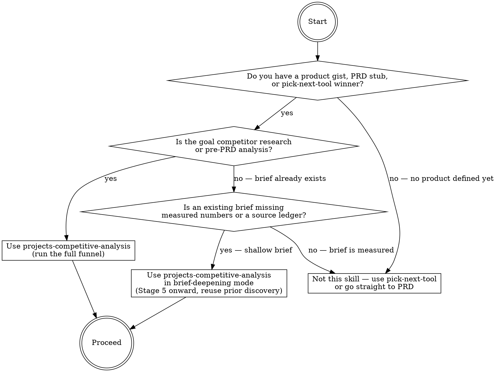
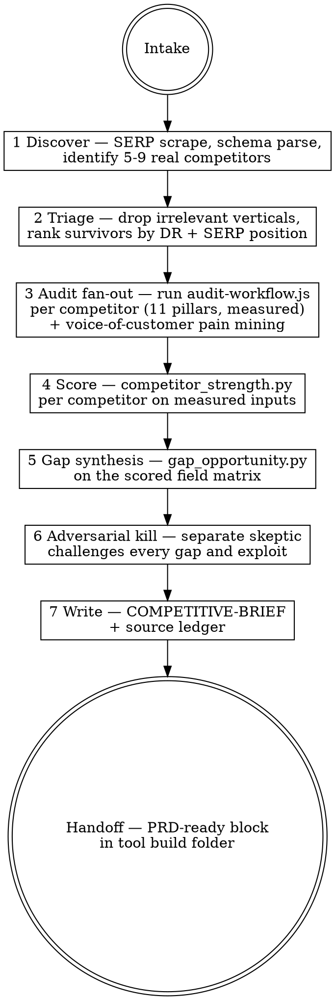

# projects-competitive-analysis

## Overview

Converts a product gist or PRD stub into a MEASURED, source-ledgered competitive brief that feeds the PRD — so every gap, every strength claim, and every exploit recommendation rests on a number pulled from a live source, not an assertion. This skill is the twin of pick-next-tool, one stage downstream: where pick-next-tool selects the tool to build, projects-competitive-analysis tells you exactly what to build and why you will win. The same discipline — evidence tiers, adversarial kill pass, engine-scored outputs — applies here. Skipping any step produces a brief that reads well but directs you to build the wrong thing.

## When to use



## IRON LAWS

```
1. NO COMMITTED EXPLOIT ON `UNVERIFIED` EVIDENCE — reasoned-tier claims are
   hypotheses, never recommendations.

2. NO PERFORMANCE OR A11y CLAIM WITHOUT A MEASURED NUMBER — "fast"/"accessible"
   is illegal without a Lighthouse score + the URL + date.

3. EVERY CLAIM CARRIES A SOURCE — url + date_accessed + method + evidence_tier
   in the ledger, or it is cut.

4. NO GAP IS AN "OPPORTUNITY" UNTIL THE ADVERSARIAL PASS CONFIRMS COMPETITORS
   MEASURABLY FAIL IT.

5. SCORES COME FROM THE SCRIPTS — quoting a strength/opportunity number you did
   not run through the engine is a skill failure.

6. THE ENGINE FAILS CLOSED — missing required field -> raise, mark UNVERIFIED,
   REFUSE to commit; "insufficient data" is a legal output.
```

Violating the letter of these laws is violating the spirit. "Competitor X is slow" without a measured LCP, or "we'll win on schema" when schema was never parsed, is a violation.

## The funnel



## Run modes / data modes

**Default: free-first.** Use OpenPageRank for DR, browser-driven Lighthouse for CWV, parse_jsonld.py for schema, live SERP screenshots for positions. No paid keys required.

**Reuse pick-next-tool research:** If `research-raw.json` exists in the tool's research folder, import it at Stage 1 — skip re-discovering competitors and domain metrics already measured there. Announce which fields are being reused and their evidence tiers.

**Paid escape hatches:** Ahrefs API for DR at scale; DataForSEO for SERP rank history; PageSpeed Insights API for bulk CWV. These upgrade evidence tiers from `triangulated` to `real-measured` — they do NOT change the gates.

Full credential setup and free-vs-paid tradeoffs: `references/data-sources.md` and `SETUP.md`.

## Mandatory checklist

Announce: **"Using projects-competitive-analysis to analyze competitors for [tool]."** Then create a TodoWrite item for EACH stage below and complete them in order. Do not advance to the next stage until the current stage is PASS.

```
0. Intake — confirm product gist, target keyword cluster, and build folder path;
   import pick-next-tool research-raw.json if available; note evidence tiers inherited.

1. Discover — SERP scrape top-10 results for the primary keyword; run parse_jsonld.py
   on each URL; record DR via OpenPageRank; produce a raw competitor list (url, dr,
   serp_position, schema_types[]) with source ledger entries.

2. Triage — drop non-competitors (directories, Wikipedia, YouTube); rank survivors;
   select 5-9 for full audit; record drop rationale per dropped URL.

3. Audit fan-out — invoke scripts/audit-workflow.js via the Workflow tool with
   {scriptPath, args:{cluster, competitors, pillar_fields}}; one audit run per
   competitor; all 11 pillars; all outputs MEASURED or marked UNVERIFIED.
   Pillar 11 pain mining runs once per CLUSTER (not per competitor): Reddit/
   forums/review mining with verbatim quotes + URLs into the ledger; Pillar 6
   interactions_to_result + input_modality_map measured per competitor.

4. Score — run scripts/competitor_strength.py on each competitor's measured audit
   output; paste literal printed scores into the brief; do NOT hand-assign.

5. Gap synthesis — run scripts/gap_opportunity.py on the full scored matrix;
   paste literal output; every gap flagged as UNVERIFIED is excluded from exploits.

6. Adversarial kill — separate skeptic re-checks: every exploit's evidence tier,
   every CWV claim's Lighthouse URL+date, every schema claim's parse_jsonld output,
   every DR number's source; any failure demotes exploit to hypothesis.

7. Write — produce COMPETITIVE-BRIEF.md in the tool's build folder; attach
   source ledger as LEDGER.md; no claim in the brief without a ledger entry.

8. Handoff — produce PRD-HANDOFF.md: top 3 exploits (adversarial-pass survivors
   only), pillar targets, schema targets, CWV targets with competitor baselines,
   plus prd_seed.pain_points (>=3-source, audit-confirmed) and
   prd_seed.input_ergonomics (canonical job + best-competitor interaction count).
```

## Quick reference: the 11 pillars

Full detail and scoring rubrics: `references/pillars.md`.

| # | Pillar | What is measured | Primary tool |
|---|--------|-----------------|--------------|
| 1 | SERP position | Rank for primary + secondary keywords | Browser SERP / DataForSEO |
| 2 | Domain Rating | Authority proxy | OpenPageRank / Ahrefs |
| 3 | Core Web Vitals | LCP, CLS, INP (mobile + desktop) | Lighthouse / PSI API |
| 4 | Structured data | Schema types present, errors | parse_jsonld.py |
| 5 | Feature completeness | Tool features vs. user jobs-to-be-done | Manual audit checklist |
| 6 | UX / accessibility | A11y score, keyboard nav, contrast | Lighthouse a11y + axe |
| 7 | Ad density | Ad slots, layout shift from ads | Manual + Lighthouse CLS |
| 8 | Export / share | File formats offered, friction | Manual audit |
| 9 | Mobile experience | Responsive breakpoints, tap targets | Lighthouse mobile |
| 10 | Content / trust signals | About page, author, update dates | Manual + parse_jsonld.py |
| 11 | Voice-of-customer pain points | Verbatim complaints (quote+URL+date) from Reddit/reviews/PAA; input-ergonomics friction: interactions_to_result, typed-text vs picker per field | Browser mining + Pillar 6 counts |

## Quick reference: scoring

**Competitor Strength** = weighted sum across 10 pillars (0–10 each); weights in `references/scoring-model.md`.
**Gap Opportunity** = mean(competitor_scores_on_pillar) subtracted from max-achievable; thresholded by evidence tier.

ALWAYS run `scripts/competitor_strength.py` and `scripts/gap_opportunity.py` — never eyeball a score. Full formula, weights, evidence-tier gating, and worked example: `references/scoring-model.md`.

## How to run the audit

> **Two operational constraints:** (1) When competitor audits share a single chrome-devtools browser, run
> them **sequentially** (one at a time) — parallel performance traces corrupt CWV readings. (2) SERP rank,
> AI-Overview, and PAA **must come from SerpApi** (`SERPAPI_KEY` in project-root `.env`) — the automation
> browser is CAPTCHA-blocked by Google. Without SerpApi all SERP fields will be null (UNVERIFIED).

Invoke `scripts/audit-workflow.js` via the Workflow tool:

```json
{
  "scriptPath": "scripts/audit-workflow.js",
  "args": {
    "cluster": "primary keyword cluster string",
    "competitors": ["https://example.com", "https://competitor2.com"],
    "pillar_fields": ["serp_position","dr","lcp_mobile","schema_types","feature_flags","a11y_score","ad_density","export_formats","mobile_score","trust_signals"]
  }
}
```

After the workflow completes:

1. Run `python3 scripts/competitor_strength.py audit-outputs/` — one score per competitor.
2. Run `python3 scripts/gap_opportunity.py scores.json` — ranked gap list.
3. Write deliverables per `references/deliverables.md` — brief, ledger, handoff block.

Do not read `audit-workflow.js` into context to study it — execute it.

## Common rationalizations — STOP

| Excuse | Reality |
|--------|---------|
| "It's obviously slow." | Run Lighthouse and paste the LCP. Without a number and a date, the claim is cut. |
| "Every tool lacks export." | You audited 3 of 9 — measure the rest before claiming a gap. |
| "The DR is about 80." | Unsourced — pull OpenPageRank or mark UNVERIFIED. |
| "The brief reads well." | A readable brief with reasoned-tier exploits is the exact failure we're fixing. |
| "Schema is probably wrong — most small tools get it wrong." | Parse it with parse_jsonld.py and paste the output. Probably is not evidence. |
| "Competitor X has bad UX, users will prefer us." | Lighthouse a11y score + specific violations, or it is an opinion, not an exploit. |
| "The gap is obvious from the feature list." | gap_opportunity.py must score it; an eyeballed gap has no evidence tier. |
| "We already know who the competitors are." | Still run the SERP scrape — the real competitors are whoever ranks, not who you expect. |
| "Users obviously hate typing times in." | A pain point without a verbatim quote + URL + date is an opinion. Mine Reddit/reviews/PAA and ledger it (Pillar 11), or mark it reasoned and keep it out of exploits. |
| "Ergonomics is subjective, can't measure it." | Count it: interactions_to_result (every keystroke + tap + select) for the canonical job, per competitor, desktop and mobile. A number or it is not in the brief (Pillar 6). |
| "They lack FAQPage/HowTo — easy rich-result win." | Rich-result value is time-boxed. Verify the type against Google's CURRENT supported list (≤60 days) — FAQ rich results died May 2026, HowTo Sept 2023. Parity ≠ exploit. |

## Red flags — you are rationalizing, start over

- You are naming an exploit whose evidence tier is `reasoned` — demote to hypothesis or go measure it -> back to Stage 3.
- You quoted a competitor strength score you did not get from `competitor_strength.py` output -> run the script and paste it; back to Stage 4.
- You listed a gap as an opportunity without running the adversarial kill pass -> back to Stage 6.
- A CWV claim in the brief has no Lighthouse URL and date -> remove it or measure it; back to Stage 3.
- You skipped the SERP scrape and assumed competitors from memory -> back to Stage 1.
- The source ledger has fewer entries than claims in the brief -> audit the brief against the ledger; back to Stage 7.
- You have exploits but no named pillar targets with competitor baselines -> Stage 8 handoff is incomplete.
- An exploit claims a UX/ergonomics win with no interactions_to_result counts and no Pillar-11 ledger quotes -> back to Stage 3.
- A schema exploit names a rich-result type you did not verify against Google's current supported list (≤60 days) -> re-verify or reframe as parity; back to Stage 5.

## Reference files

- `references/scoring-model.md` — the full strength and opportunity formulas, pillar weights, evidence-tier gating rules, and a worked calibration example.
- `references/pillars.md` — the 10 pillars in full: definition, measurement method, scoring rubric (0–10), and pass/fail thresholds.
- `references/audit-procedure.md` — the step-by-step audit procedure per competitor: exactly what to run, what to record, and what constitutes a PASS at each pillar.
- `references/data-sources.md` — the free-first toolchain (OpenPageRank, Lighthouse, parse_jsonld.py, browser SERP) plus paid escape hatches, with evidence tiers each source produces.
- `references/deliverables.md` — copy-paste templates for COMPETITIVE-BRIEF.md, LEDGER.md, and PRD-HANDOFF.md, including required sections and ledger entry format.
