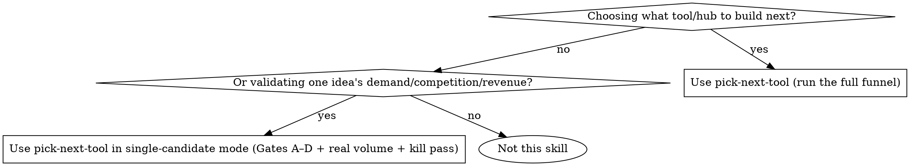
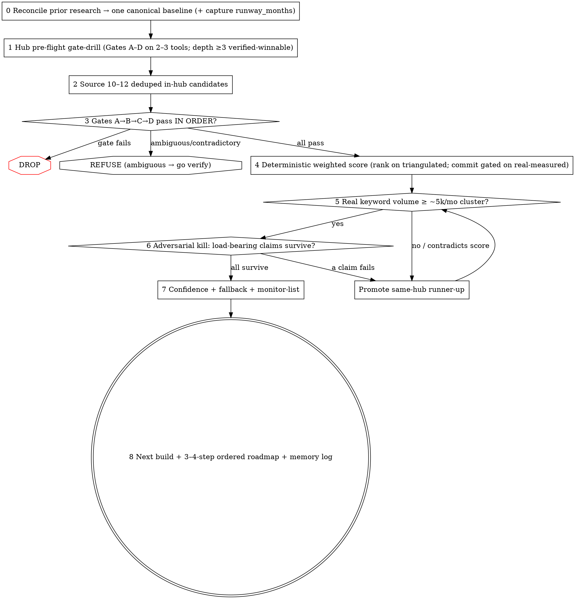

# Pick Next Tool

## Overview

Pick the next tool (and the hub it lives in) with a single reproducible, data-backed funnel — so the same inputs always produce the same winner. Three different agents once ran three different processes on this exact portfolio and picked three different tools. The reason was never the data; it was that each used a different shortlist, a different volume source, and subjective scores. This skill removes that variance: fixed candidate sourcing → ordered kill-gates → **deterministic** scoring on real data → an adversarial kill pass.

**Core principle:** For a brand-new, zero-authority domain, **winnability — not demand — is the binding constraint.** High volume you cannot rank for is worth zero. Everything here optimizes for "can a thin new site actually rank this, and will AI leave it alone," then ranks the survivors on money and durability.

## When to use



## IRON LAWS

```
1. NO TOOL IS CHOSEN ON ESTIMATED VOLUME.
   Real keyword data (Stage 5) is a BLOCKING gate. Triangulated/SERP-density
   numbers rank candidates; they NEVER select the winner.

2. NO SCORING BEFORE ALL FOUR KILL-GATES PASS.
   Run Gate A → B → C → D in order, cheapest first. STOP at the first
   failure: do not compute or report downstream gates, and emit NO
   Opportunity number for a dropped candidate. A gate failure is never
   rescued by strong scores on the other dimensions.

3. NO WINNER WITHOUT A SURVIVED ADVERSARIAL KILL PASS.
   A separate skeptic re-checks the 2–3 load-bearing claims (real volume,
   AI-Overview presence, revenue-to-buyer-slice). Any outright failure
   promotes the same-hub runner-up and re-runs Stages 5–6 on it.

4. THE FIRST BUILD HAS NO DIMENSION SCORED 1.
   Any single 1 is an automatic VETO regardless of total. Pick the
   all-rounder (no fatal weakness), never the highest-on-one-axis trap.

5. THE ENGINE FAILS CLOSED, AND "REFUSE" IS A LEGAL ANSWER.
   Every required input is read by direct indexing — a missing/mistyped key
   RAISES, never silently passes (ADR-0009). An AdSense-restricted vertical
   (gambling/alcohol/adult/drugs/weapons) is the FIRST Gate-A DROP, no matter
   how high its CPC. Evidence tiers are enforced IN CODE: a tool is
   `first_build_eligible` only when Demand+Winnability+AI-Resistance are all
   `real-measured`. When the data is ambiguous or contradictory, the honest
   output is REFUSE → go verify — not an optimistic OK or a confident DROP.
```

**Violating the letter of these laws is violating the spirit.** "The score is 89 so ship it" without the veto check, the evidence-tier check, and the kill pass is a violation. The full rationale lives in `docs/adr/` — read it for the why behind every rule.

## The funnel



## Run modes

Invoke with a mode flag (default `--checkpoints`):

- **`--checkpoints`** (default, human-in-loop): pause for user confirmation at three points — (1) the candidate shortlist after Stage 2, (2) the finalists before the real-data pull (Stage 4→5), (3) the winner before writing deliverables (after Stage 6). Use when the stakes or the budget matter.
- **`--auto`** (autonomous): run end-to-end; stop ONLY when data is genuinely ambiguous (e.g. real volume lands in a band that straddles the threshold, or the kill pass is inconclusive). Use for speed or batch runs.

Both modes run the identical funnel and the identical gates. The mode changes only *where it pauses*, never *what it checks*.

## Data modes

Also choose how the real data is gathered (default `--data=hybrid`):

- **`--data=manual`** — zero setup. Browser MCP + free sites only (incognito Google for the SERP/AI-Overview read; Ahrefs free Keyword Generator for volume bands). Most robust, most hands-on.
- **`--data=hybrid`** (default) — automate discovery + volume via the scripts where credentials exist; cross-check the SERP/AI-Overview in the browser; fall back to free sites otherwise.
- **`--data=auto`** — fully scripted via the free APIs (needs the one-time keys in `SETUP.md`); falls back to a browser check if a credential is missing.

The data mode changes only HOW inputs are measured — never the gates, the scoring, or the run-mode checkpoints.

## Mandatory checklist

Announce: **"Using pick-next-tool to select the next tool for [hub]."** Then create a TodoWrite item for EACH stage and complete them in order:

```
0. Reconcile prior research → canonical baseline (resolve contradictions; confirm uncertain premises with the user; CAPTURE runway_months as an input — ADR-0004)
1. Hub pre-flight gate-drill → run Gates A–D quickly on 2–3 representative tools; require depth ≥3 verified-winnable tools; prefer the deeper hub; record the hub choice as an ADR (ADR-0005)
2. Source a deduped 10–12 candidate shortlist inside the hub   [--checkpoints: confirm shortlist]
3. Kill-gates A→B→C→D in order (DROP failures; REFUSE on ambiguous/contradictory inputs — both are valid outcomes, ADR-0001)
4. Deterministic weighted score on the standard model (evidence-tier every score; rank on triangulated, commit only on real-measured — ADR-0009)   [--checkpoints: confirm finalists]
5. Real keyword-volume verification (BLOCKING — browser-driven Ahrefs/free toolchain)
6. Adversarial "kill the winner" (separate skeptic; re-check volume + AIO + buyer-slice revenue)   [--checkpoints: confirm winner]
7. Confidence + named same-hub fallback + monitor-list
8. Emit the deliverables — the next build PLUS a short 3–4-step ordered roadmap (ADR-0007) — and log the decision to memory (supersede stale drafts in writing)
```

Heavy detail is in the reference files — read the one for the stage you are on:

- **`references/process.md`** — the full 9-stage procedure (actions, data sources, pass/fail rule, outputs per stage) + the hub-gate criteria + the contradiction-reconciliation rule.
- **`references/scoring-model.md`** — the DETERMINISTIC 5-dimension rules (Demand head-bucket+bonus, Winnability thin-site-proof/KD+weakCount, live AI-Overview, Revenue CPC+buyer-slice, Build effort), the weighted formula, the GATE-FAIL/veto rules, evidence tiers, and the worked calibration — all mirroring `scripts/score.py`, the source of truth.
- **`references/free-tools.md`** — the verified free + open-source toolchain, the recommended layered stack, and the exact operational steps to pull real keyword data (browser-driven).
- **`references/deliverables.md`** — copy-paste templates for the 6 output artifacts.
- **`references/live-recheck.md`** — the runtime re-verification list: every stale quota/threshold/stat (SerpApi free cap, ad-network thresholds, AIO prevalence) with how to re-check it. Treat all free volume as ORDINAL; re-verify anything load-bearing before naming a winner.
- **`scripts/score.py`** — the deterministic scoring engine. Run it on the measured inputs (`python3 scripts/score.py candidates.json`); never hand-score. `--selftest` is a **snapshot (mutable, fails loud on recalibration) + immutable structural & golden-bad invariants** (ADR-0003) — PASS means the engine is wired right and refuses duds, not that Timesheet is the right pick.
- **`docs/adr/`** — the nine ADRs behind every rule (ruin-avoidance, uncalibrated config, selftest shape, time-to-rank, hub rigor, future-SERP, roadmap deliverable, soft bands, input integrity). Read these for the *why*.
- **`SETUP.md`** — one-time setup for `--data=auto` ONLY: how to get the free API keys (Google Ads, Bing Webmaster, OpenPageRank, SerpApi). `--data=manual`/`hybrid` need none of it.
- **`scripts/research-workflow.js`** — the parameterized Workflow the skill runs each invocation — one researcher + one adversarial skeptic per candidate, returning `score.py`-ready MEASURED inputs (not subjective scores). Run it with the Workflow tool, passing `{hub, dataMode, skillDir, candidates}`; do NOT read it into context to "study" it — execute it. (In auto/hybrid mode it calls `autocomplete_fanout.py`, `volume_buckets.py`, `dr_wall.py`.)

## Quick reference — the scoring model

`Opportunity = (0.20·Demand + 0.25·Winnability + 0.25·AI-Resistance + 0.20·Revenue + 0.10·Build) × 20` → 0–100.
Winnability + AI-Resistance outrank Demand on purpose. **Do not hand-assign the 1–5s — run `scripts/score.py` on the measured inputs the research workflow returns.** It computes every dimension deterministically (Demand = head-volume bucket + a deep-cluster/real-traffic bonus on the lower-bound estimate; Winnability = EVIDENCED thin-site-proof, else KD+weakCount; AI-Resistance = live-AIO check projected to rank-time; Revenue = CPC + strong-buyer-slice-gated affiliate; Build = effort), so the same inputs always yield the same winner. Tag each score's evidence tier (real-measured / triangulated / reasoned); gate-dropped/refused candidates get NO Opportunity number; any dimension = 1 vetoes a first build. `python3 scripts/score.py --selftest` is the regression test: a **mutable snapshot** (currently Timesheet = 89; it **fails loud on recalibration** so a human re-blesses the new number — ADR-0003) **plus immutable structural & golden-bad invariants**. "selftest PASS" means the engine is **wired right and refuses duds** — NOT that Timesheet is the correct pick.

## Common rationalizations — STOP

| Excuse | Reality |
|--------|---------|
| "The ranking/atlas already says tool X is #1." | The inherited ranking is a stale hypothesis, not the verdict. Re-verify it live. It was wrong about QR (winnability 1) and freelance-rate (<100/mo). |
| "Search volume looks high from the SERP density." | SERP density is a `reasoned` estimate. Demand is not a fact until Stage 5 real data. The qualifier kills the volume — measure the broad commercial term. |
| "Head term is competitive, so kill it." | You buy the long-tail, never the head. A thin/low-DR site already ranking the long-tail is a PASS, not a fail. |
| "It scored 89, so it's the pick." | Check the veto (any 1?) and the evidence tier of each score. A high score on guessed inputs is provisional until verified. |
| "CPC is high, so Revenue = 5." | Discount affiliate to the BUYER slice. CPC alone tops out at Revenue 4 — the +1 to 5 needs a recurring affiliate AND `buyer_slice == "strong"`. If most of the audience won't purchase (e.g. employees totalling their own hours), it's display-first, not affiliate-rich. |
| "It's a high-CPC niche so Revenue = 5." | Check `adsense_restricted` FIRST. Gambling/CBD/adult = $0 monetizable → Gate-A DROP no matter the CPC. A high bid on an unmonetizable vertical is worth nothing. |
| "A thin site ranks it, so winnability is fine." | Only if EVIDENCED — `thin_site_proof_url` + `thin_site_proof_dr` + `thin_site_proof_keyword`. A bare asserted bool is ignored and flagged. And it caps at 3 over a DR-90+ head (`kd_head > 80`): a thin site beating a DR-90 wall is suspect, not proof. |
| "The data's ambiguous but I'll pick anyway." | No — that's a REFUSE. A `winnability==1` in the KD 21–25 noise band, or a head bucket implying more volume than the whole cluster, returns REFUSE → go verify. Picking on a coin-flip is the dud-greenlight failure (ADR-0001/0008). |
| "It'll rank eventually." | Time-to-traffic vs runway (ADR-0004). A winnable-but-slow tool that matures past the runway is the fatal outcome, not opportunity cost. If `est_time_to_traffic_months > runway_months` it's a fast-follow, not the opener. |
| "I'll skip the kill pass, the data looks solid." | The kill pass is mandatory and uses a SEPARATE skeptic. It exists to break "solid"-looking picks before you waste build effort. |
| "Both modes feel like overkill, I'll just decide." | Deciding without the funnel is exactly what produced three different answers. Run it. |
| "I'll just assign the 1–5 scores myself; I can see they're about right." | No — hand-assigned scores are the exact variance that gave three agents three answers. Feed the measured inputs to `scripts/score.py`; it is the source of truth, and `--selftest` proves it reproduces the real decision. |
| "The ranking says 74, so the score is ~74." / "score.py would give about X." | Run it and paste the literal output. A number quoted from memory or from the inherited ranking is a fabrication — in testing an agent "quoted" a `score.py` total the engine never produced. Gate-dropped tools have **no** number at all. |

## Red flags — you are rationalizing, start over

- You are about to name a winner whose demand score rests on triangulated/reasoned data → **Stage 5 first.**
- You scored a candidate without running Gates A–D in order → **back to Stage 3.**
- You cited an Opportunity number or a gate verdict you did not get from `score.py`'s actual printed output → **run `score.py` and paste it; a remembered number is a fabrication.**
- You skipped the live AI-Overview check and assumed it from intent → **check the live SERP.**
- You have one bet and no named same-hub fallback → **Stage 7 is incomplete.**
- The winner was chosen because the user "already owns the domain" or any single tiebreaker → **verify that premise with the user; it has been wrong before.**

All of these mean: stop, return to the named stage, and run it before claiming a winner.
