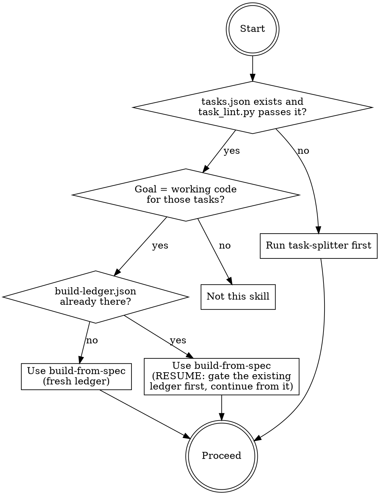
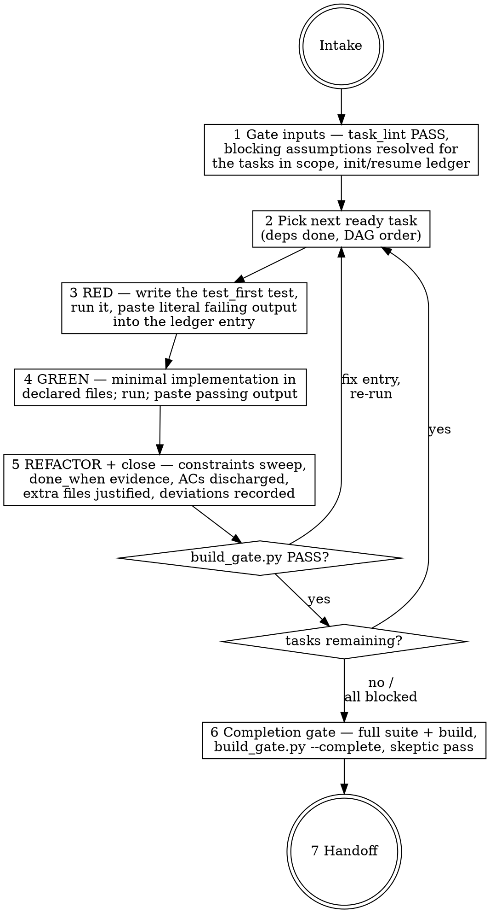

# build-from-spec

## Overview

Executes `tasks.json` (from `task-splitter`) task by task — TDD red-green-refactor inside each
task — and maintains **`build-ledger.json`**: the machine-readable evidence record that every
test failed before its implementation existed, every done_when clause was literally verified,
every file touched was declared or justified, and every acceptance criterion was discharged by
its owning task. Stage 6 of the house pipeline: pick → measure → PRD → design → split →
**build**. The engine `scripts/build_gate.py` validates the ledger fail-closed. The documented
baseline failure this skill exists to prevent: an agent that builds good code and reports
"21 tests failing → now green" in chat — with the test and implementation in the same commit,
eight undeclared files touched, an unrecorded Astro-version swap, and zero evidence that
survives the session.

## When to use



## IRON LAWS

```
1. THE LEDGER IS THE BUILD — work not recorded in build-ledger.json with
   literal command-output excerpts does not exist. A chat report is not
   evidence; the ledger is what survives the session and what the next
   pipeline stage reads.

2. RED IS CAPTURED BEFORE THE IMPLEMENTATION EXISTS — for every test-first
   task: write the test, RUN it, paste its literal failing output into the
   ledger, and only then write the implementation. Writing test and
   implementation together and running once at the end is test-after — the
   documented baseline failure, not a shortcut.

3. DAG ORDER, ONE TASK OPEN AT A TIME — never start a task whose depends_on
   is not done; close or block the open task before opening the next.
   (Parallel executors may hold multiple in_progress tasks ONLY if they are
   dependency-independent — the gate checks.)

4. TOUCH ONLY DECLARED FILES — a file outside the task's files[] gets a
   justified extra_files entry at the moment it is touched. If a task keeps
   needing undeclared scope, STOP and amend tasks.json (versioned, per
   task-splitter), never silently sprawl.

5. DEVIATIONS ARE RECORDED, NOT NARRATED — any departure from tasks.json,
   build-spec, DESIGN.md, or the scaffold docs goes in deviations[] with
   what + why, the moment it is decided. "Surfaced it in my summary" is
   narration; the ledger entry is the record.

6. NEVER WEAKEN A TEST TO GO GREEN — no deleting, skipping, or loosening an
   assertion to make a task pass. A red you cannot honestly fix = status
   "blocked" with the blocker recorded, and the build stops there. Only a
   HUMAN can waive an acceptance criterion (waivers[] — the gate rejects
   agent self-waivers).
```

Violating the letter of these laws is violating the spirit. "The tests were obviously going to
fail, I skipped the red run" or "the lock file doesn't really count as a touched file" is a
violation.

## The loop



Tasks whose `test_first.required` is false (scaffold/content/qa/deploy) skip stage 3 — their
evidence is the literal `done_when_evidence` output (build log, word-count script, gate spec
run). QA-kind tasks ARE verification: their "green" is the gate spec passing against the built
site.

## Inputs

The tool's build folder: `tasks.json` (re-verify with `task_lint.py` — never build from an
unlinted split), `build-spec.json` (AC predicates = what the tests assert), `DESIGN.md` (tokens,
states, layout the UI tasks implement), and the template scaffold (`_template/` + SCAFFOLD.md)
for scaffold tasks. REFUSE to start if task_lint fails, or if a BLOCKING assumption in
tasks.json gates a task in the requested scope — ask the user first. Non-blocking assumptions:
apply the recorded default and cite it in the ledger entry.

## Mandatory checklist

Announce: **"Using build-from-spec to build [tool]."** Create a TodoWrite item for EACH stage
and complete them in order. Do not advance until the current stage is PASS.

```
0. Intake — load tasks.json + build-spec + DESIGN.md + SCAFFOLD.md; run
   task_lint.py on tasks.json (paste output); confirm which tasks are in
   scope this run; check blocking assumptions against that scope.

1. Ledger — create build-ledger.json next to tasks.json (tool, generated_from,
   app_root, complete:false, empty arrays). If one already exists: run
   build_gate.py on it FIRST, then resume from its state — never overwrite
   or rebuild done tasks.

2. Per task, in DAG order — mark the entry in_progress. RED: write the
   test_first test, run it, paste the literal failing output (red.test must
   equal the declared test path). GREEN: implement minimally inside declared
   files, run, paste the literal passing output. REFACTOR: clean up only
   what this task created; sweep standing_constraints.

3. Close the task — done_when_evidence (literal output), acs_discharged
   (exactly the owned set), files_touched complete with extra_files
   justified, deviations recorded. Set status done.

4. Gate — python3 scripts/build_gate.py build-ledger.json tasks.json
   build-spec.json. Paste the literal output. PASS before the next task.

5. Blocked path — a red you cannot fix, a missing credential, an unresolved
   blocking assumption: set status blocked + blocker text on the entry, and
   move to the next dependency-free task or stop. Never stub, skip, or
   weaken your way past it.

6. Completion gate (only when every task is done or blocked) — run the FULL
   test suite + production build, paste outputs; set complete:true; run
   build_gate.py with --complete; ONE skeptic subagent (or labeled
   self-pass) challenges evidence honesty: do the excerpts look like real
   tool output, does each green actually cover its claimed ACs, are
   deviations complete? BLOCKING = objective defect; fix and re-gate.

7. Handoff — tasks done/blocked counts, ACs discharged vs total, waivers,
   deviations count, ledger path, what the next stage (qa-gate-runner /
   ship) needs to know.
```

## Quick reference: the engine

`python3 scripts/build_gate.py build-ledger.json tasks.json build-spec.json [--complete]`

| Check | Rule |
|---|---|
| G1 structure | parses; required keys; entries name real tasks; no duplicates |
| G2 order | done ⇒ all deps done; concurrent in_progress entries dependency-independent |
| G3 evidence | test-first tasks: literal red (failure signal) + green (pass signal, no fail count), red ≠ green, red.test matches; every done entry has done_when_evidence |
| G4 file scope | files_touched ⊆ declared files[] ∪ per-file justified extras |
| G5 AC parity | done entry discharges exactly the ACs its task owns |
| G6 completion | with --complete/complete:true — every task done or blocked; every must AC discharged or human-waived |
| G7 honesty | deviations have what+why; blocked entries have a blocker; waivers have a human "by" + reason |

`build_gate.py --selftest` proves the engine refuses duds (golden-good + golden-bad fixtures).

## Common rationalizations — STOP

| Excuse | Reality |
|---|---|
| "I'll report progress in chat; the ledger is bureaucracy." | Chat dies with the session. The ledger is the only artifact qa-gate-runner, ship, and a resuming agent can read (IRON LAW 1). |
| "Writing test + implementation together is faster; I'll run once at the end." | That run proves nothing — a test that never failed can't catch the bug it was written for. Capture the red first (IRON LAW 2). |
| "The test was obviously going to fail — no need to actually run it." | "Obviously failing" tests pass surprisingly often (wrong path, auto-mock, stale build) — and then they were never tests. Run it (IRON LAW 2). |
| "package-lock/tsconfig don't really count as touched files." | They count. One-line justified extra_files entry and move on (IRON LAW 4). |
| "While I'm in this file I'll fix the next task's part too." | That file belongs to a different task's declared scope. Close this task; the DAG will get you there (IRON LAWS 3, 4). |
| "Astro 6 is better than the pinned 5.13 — I'll just use it." | Maybe! Record it in deviations[] with the why — the exact unrecorded swap from the baseline run (IRON LAW 5). |
| "This assertion is too strict; relaxing it unblocks the build." | Weakened green = permanently lying test suite. Block the task and say why; only the user waives ACs (IRON LAW 6). |
| "The gate passed, skip the completion skeptic." | The gate checks structure; the skeptic checks honesty — pasted excerpts can be fabricated, greens can under-cover claimed ACs. Run stage 6. |

## Red flags — you are rationalizing, start over

- You wrote implementation code and the ledger entry has no red excerpt yet -> delete the implementation, stage 2 (run the red first; deleting means deleting).
- Your red "output" is a paraphrase ("it failed as expected") instead of pasted tool output -> stage 2.
- Two entries in_progress and one depends on the other -> stage 2.
- `git status` shows files no ledger entry accounts for -> stage 3.
- You are deciding a version/library/approach change and typing it into your summary instead of deviations[] -> stage 3.
- You just edited an assertion to make a test pass -> stage 5 (blocked path).
- complete:true and you haven't run the full suite + --complete gate + skeptic -> stage 6.

## Reference files

- `references/ledger-template.md` — the build-ledger.json schema with a worked micro-example.
- `scripts/build_gate.py` — the fail-closed engine (`--selftest` included).
- `evals/evals.json` — RED-GREEN behavioral evals (baseline failures this skill corrects).
