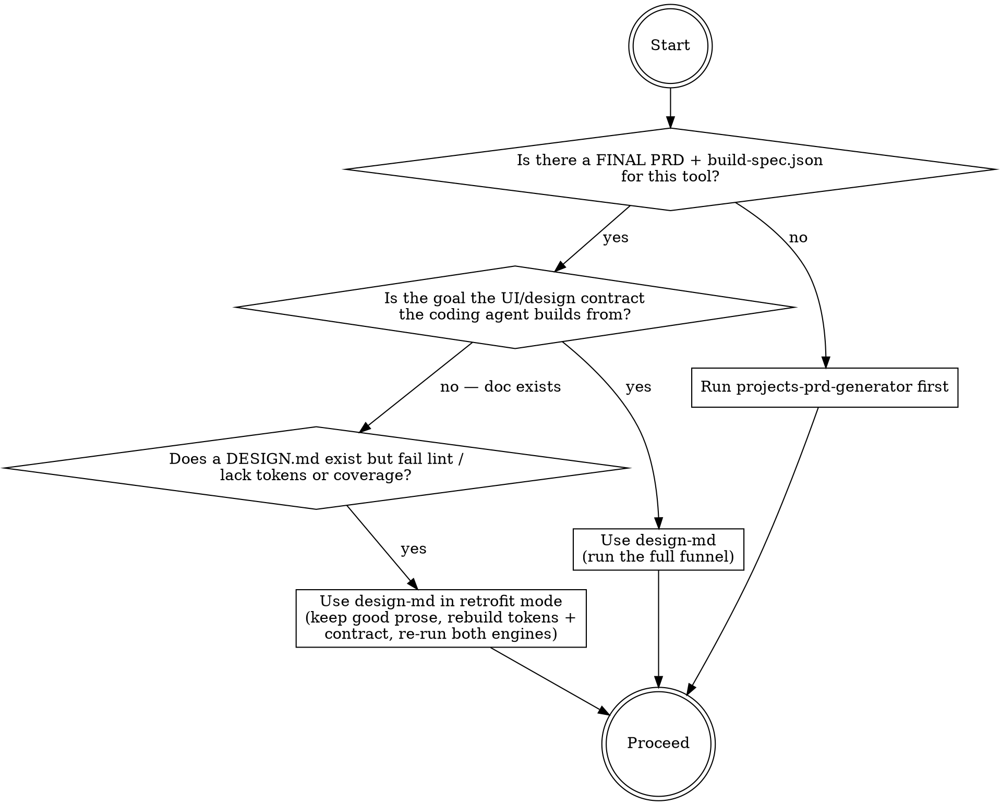
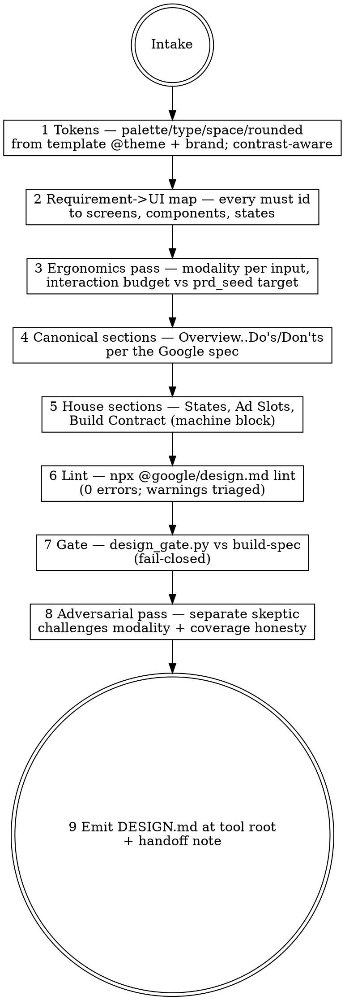

# design-md

## Overview

Converts a FINAL PRD + `build-spec.json` (from `projects-prd-generator`) into a **DESIGN.md that
conforms to Google's DESIGN.md format** (google-labs-code/design.md, the spec behind getdesign.md):
machine-readable design tokens in YAML front matter + prose rationale in canonical sections — plus
this pipeline's house extensions (a machine-checkable Build Contract). Stage 4 of the house
pipeline: pick → measure → PRD → **design** → build. Two engines validate the output: Google's
official linter (`npx @google/design.md lint` — token refs, WCAG contrast, section order) and
`scripts/design_gate.py` (requirement coverage, input ergonomics, ad-slot reservation, states).
A design doc that reads beautifully but has no tokens, no coverage map, or typed-text time fields
is the exact failure this skill makes structurally impossible.

## When to use



Family variants: when a sibling tool in the same hub already has a gate-passing DESIGN.md, start
from it (copy tokens, restate coverage for the new build-spec) — do not re-derive the brand.

## IRON LAWS

```
1. TOKENS ARE THE SOURCE OF TRUTH — every color, font, size, radius, and spacing
   value used anywhere in the prose exists as a YAML front-matter token. A value
   that appears only in prose, or only as a CSS/Tailwind class name, is illegal.

2. SPEC-CONFORMANT OR IT IS NOT A DESIGN.MD — Google's DESIGN.md spec governs:
   YAML token schema, canonical section order (Overview, Colors, Typography,
   Layout, Elevation & Depth, Shapes, Components, Do's and Don'ts; house
   sections AFTER these). `npx @google/design.md lint` must report 0 errors;
   every warning is triaged in writing (fix or justify).

3. EVERY MUST-REQUIREMENT HAS A HOME — the Build Contract maps every must-
   priority requirement id in build-spec.json to the section(s) that design it.
   design_gate.py fails closed on any gap. An uncovered must-have is a silent
   scope hole, not a styling choice.

4. INPUT MODALITY IS EVIDENCE-DRIVEN — structured data (times, dates, currency,
   rates, quantities) is NEVER collected via typed free text unless the contract
   carries a written justification. Honor prd_seed.input_ergonomics: declare the
   canonical job's interaction budget and meet the upstream target.

5. ADS NEVER DISPLACE THE TOOL — every ad slot is below the fold with a reserved
   min-height (CLS protection); the tool is visible and operable above the fold
   at 360 px and 1280 px. No slot inside or above the tool. Ever.

6. NOTHING SPECULATIVE — every component traces to a requirement; a mandatory
   do-not-build list closes scope (mirror of the PRD's three-sided scope).
   "It would look nice" is not a source.
```

Violating the letter of these laws is violating the spirit. A "warm, modern palette" with no hex
tokens, a coverage table the engine cannot parse, or a time field rendered as `<input type=text>`
"for flexibility" is a violation.

## The funnel



## Inputs

Reads the tool's build folder: `PRD.md` (FINAL), `build-spec.json` (requirement ids + acceptance
criteria + benchmarks), the brief's `prd_seed` block (`pain_points`, `input_ergonomics`,
`ai_overview_risk`, monetization notes) when present, and the scaffold's existing tokens
(`_template/src/styles/global.css` `@theme`, components inventory). REFUSE to run without a FINAL
PRD + build-spec ("run projects-prd-generator first"). Pull the live format spec with
`npx @google/design.md spec` at intake — the format is alpha and moves; never restate it from memory.
(Known snag: some published builds ship without the spec file — v0.2.0 errors on `spec`. Fallback:
read the format reference from the installed package's README, e.g.
`npm view @google/design.md readme` — do NOT fall back to memory.)

## Mandatory checklist

Announce: **"Using design-md to write the DESIGN.md for [tool]."** Create a TodoWrite item for EACH
stage and complete them in order. Do not advance until the current stage is PASS.

```
0. Intake — confirm build folder; load PRD + build-spec + prd_seed + template
   @theme + component inventory; run `npx @google/design.md spec`; list every
   must-requirement id you must cover.

1. Tokens — define colors/typography/spacing/rounded/components in YAML front
   matter. Reuse template tokens; new tokens need a one-line reason. Check
   every backgroundColor/textColor pair for WCAG AA (4.5:1) AT TOKEN TIME —
   the linter will catch failures, fix them before it has to.

2. Requirement->UI map — for every must id: which screen/component/state
   satisfies it. Draft the Build Contract's requirement_coverage as you go.

3. Ergonomics pass — per input field: modality (native picker / select /
   stepper / chips / typed-text-with-justification), defaults, accelerators.
   Count the canonical job's interactions; declare interaction_budget
   {target from prd_seed, estimated from your spec}; estimated <= target.

4. Canonical sections — write Overview, Colors, Typography, Layout,
   Elevation & Depth, Shapes, Components, Do's and Don'ts (omit a section
   only if truly empty; order is fixed; prose explains WHY tokens exist).

5. House sections (after canonical, in this order): States (default/empty/
   error/loading/success per interactive surface), Ad Slots (position,
   min-height px, above_fold:false), Build Contract (the fenced JSON block —
   schema in references/design-template.md).

6. Lint — `npx @google/design.md lint DESIGN.md`. Paste the literal JSON.
   0 errors required; write a one-line triage per warning (fix or justify).

7. Gate — `python3 scripts/design_gate.py DESIGN.md <build-spec.json>`.
   Fail-closed. Paste the literal output. PASS required.

8. Adversarial pass — dispatch ONE separate skeptic subagent: it re-checks
   (a) every typed-text modality's justification against pain_points evidence,
   (b) coverage honesty (does the cited section really satisfy the AC?),
   (c) ad-slot law, (d) anything speculative. BLOCKING = objective defect
   (uncovered must, unjustified typed-text, ad slot above fold, token used in
   prose but undefined); fix and re-run 6-7. Advisory = fold in, don't block.

9. Emit — write DESIGN.md to the tool's app root (next to PRD.md in the build
   home). Optional: `npx @google/design.md export --format css-tailwind` to
   refresh the template @theme. Print handoff: coverage count, budget, lint +
   gate verdicts. Never overwrite an existing DESIGN.md silently — write
   DESIGN-v<N>.md and note supersession.
```

## Quick reference: the two engines

| Engine | Command | Checks | Pass bar |
|---|---|---|---|
| Google linter (official) | `npx @google/design.md lint DESIGN.md` | YAML schema, broken `{token.refs}`, WCAG AA contrast on component pairs, section order, orphaned/missing tokens | 0 errors; warnings triaged in writing |
| House gate | `python3 scripts/design_gate.py DESIGN.md build-spec.json` | Build Contract present + parseable; every must id covered; interaction budget declared (target > 0) and estimated ≤ target; no unjustified typed/free-text modality; ad slots reserved + below fold OR an ads_excluded_reason; all five states named (default/empty/error/loading/success) | PASS (fail-closed; missing block = FAIL) |

`design_gate.py --selftest` proves the gate refuses duds (golden-good + golden-bad fixtures).

## Common rationalizations — STOP

| Excuse | Reality |
|---|---|
| "The palette is described in the prose, that's enough." | Prose without front-matter tokens is unverifiable and unexportable (IRON LAW 1). The linter checks contrast on TOKENS. |
| "Our sections are better organized than the spec's." | The canonical order exists so agents and tools can parse any DESIGN.md. House content goes in custom sections AFTER the canonical eight (IRON LAW 2). |
| "Coverage is obvious — the whole doc is about the requirements." | If design_gate.py can't read it, it doesn't exist. Fill requirement_coverage with real ids and real section anchors (IRON LAW 3). |
| "A text input is more flexible for times." | Typing structured data on a phone is the #1 measured pain (see the pipeline's Pillar 11). Native picker/steppers by default; typed text only with written evidence (IRON LAW 4). |
| "One ad above the tool won't hurt." | Google's spam policy names tool sites whose ads displace utility; it is also the CLS killer. Below the fold, reserved height, no exceptions (IRON LAW 5). |
| "I'll add a settings panel — users might want it." | No requirement, no component. Put it in the do-not-build list (IRON LAW 6). |
| "Lint warnings are fine to ignore." | Each warning gets one line: fixed, or why it stands. Silent warnings rot. |
| "I remember the DESIGN.md format." | The spec is alpha and moves. `npx @google/design.md spec` at intake, every run. |

## Red flags — you are rationalizing, start over

- A color/size value appears in prose or a class name with no matching front-matter token → stage 1.
- A must-requirement id from build-spec.json is absent from requirement_coverage → stage 2.
- Any structured-data field is typed free text with no justification entry → stage 3.
- interaction_budget.estimated exceeds the upstream target → stage 3 (tune accelerators, not the budget).
- An ad slot has no min_height_px or sits above the fold → stage 5.
- You are about to emit without pasting BOTH engines' literal output → stages 6–7.
- The skeptic pass was skipped because "the gate passed" → stage 8; the gate checks structure, the skeptic checks honesty.

## Reference files

- `references/design-template.md` — the DESIGN.md skeleton (front-matter example, canonical
  sections, house sections, the Build Contract JSON schema with a worked example).
- `scripts/design_gate.py` — the fail-closed house gate (`--selftest` included).
- `evals/evals.json` — RED-GREEN behavioral evals (baseline failures this skill corrects).
