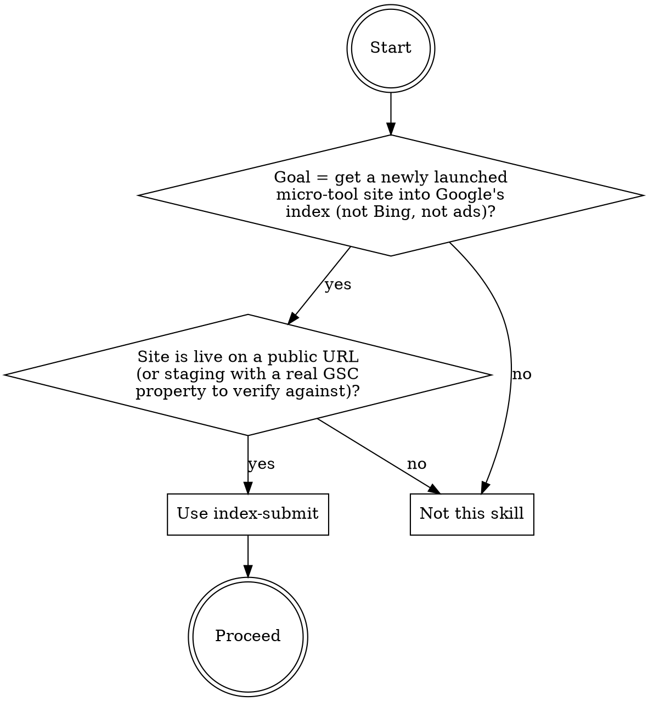
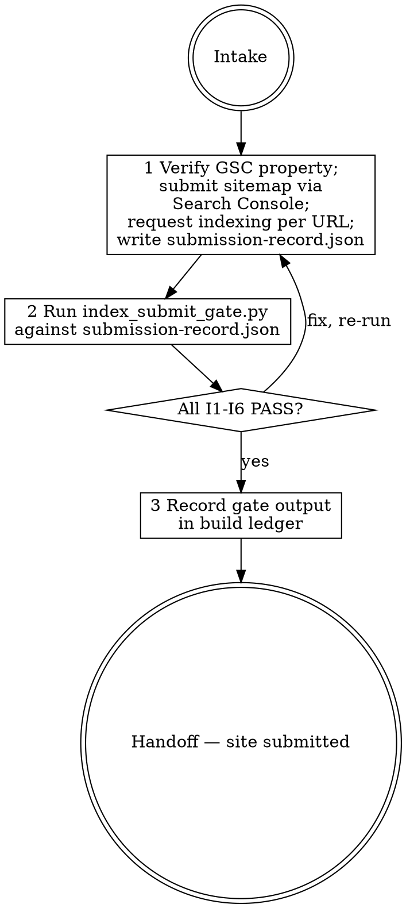

# index-submit

## Overview

Directs the submission of a live micro-tool site to Google's index through the correct, current channels — verifying a Google Search Console property, submitting the sitemap through the Search Console UI or Sitemaps API (not the removed ping endpoint), and requesting indexing for each new URL via the URL Inspection tool. The skill produces a structured `submission-record.json` artifact; the engine `scripts/index_submit_gate.py` validates that record against six fail-closed checks (I1–I6) and exits 0 (PASS) or 1 (FAIL). The gate inspects the JSON record only — it makes no network calls and requires no credentials.

**Limitation:** The gate inspects the JSON record only and makes no network calls. It cannot verify that `gsc.verified: true` reflects a real GSC verification — a fabricated record with `verified: true` will pass the gate. The agent must actually execute the GSC verification and submission steps before writing the record; do not write the record speculatively.

The documented baseline failure this skill exists to prevent: a skill-less haiku run on 2026-06-12 submitted the sitemap by curling the dead `https://www.google.com/ping?sitemap=...` endpoint (Google removed it — it is a no-op), included an IndexNow POST to api.indexnow.org as a "supplementary Google submission step" while itself noting "Google does not use IndexNow", left per-URL indexing as a manual to-do with no recorded result per URL, and produced a SUBMISSION_RECORD.json explicitly marked `real_api_calls_made: false` and `submission_type: unaided_baseline` — a plan serialized as JSON, not an executed submission.

## When to use



## IRON LAWS

```
1. THE SITEMAP PING ENDPOINT IS DEAD — SUBMIT VIA SEARCH CONSOLE — Google removed
   the sitemaps ping endpoint (google.com/ping?sitemap=...). Curling or referencing
   that URL is a no-op. The only accepted sitemap submission channels are the Search
   Console UI (Sitemaps section) and the Sitemaps API. The baseline curled the dead
   ping endpoint and recorded it as a successful submission — that is the verbatim
   failure this law exists to prevent.

2. INDEXNOW DOES NOT BELONG IN A GOOGLE SUBMISSION RECORD AT ALL — IndexNow is a
   Bing/Yandex protocol. Google does not use it. Recording an IndexNow POST to
   api.indexnow.org as a Google indexing step — even a "supplementary" one — is
   misleading and wasted. There is no safe annotation: the gate refuses any Google
   submission record that contains the word "indexnow" anywhere. If you want to
   record a Bing IndexNow submission, do it in a separate Bing submission record.

3. PER-URL INDEXING MUST BE REQUESTED AND RECORDED — every URL in the site must
   have a recorded, completed indexing request via the URL Inspection tool in Search
   Console. A to-do list, a note to "go to Search Console and click Request Indexing",
   or a status of planned/pending/todo is not a submission record. The baseline left
   per-URL indexing as a manual to-do with no recorded result — that record fails I5.

4. A PLAN IS NOT A SUBMISSION — THE RECORD REFLECTS EXECUTED RESULTS — the
   submission-record.json must document what was actually done. A record marked
   real_api_calls_made: false, submission_type: plan/baseline/unaided_baseline/draft,
   or status: planned/not_submitted is explicitly a plan, not a submission. The
   baseline produced a SUBMISSION_RECORD.json with all three of those markers — a
   plan serialized as JSON — and the verdict was 'submitted IF steps are executed'.
   That conflation is exactly what law 4 was written to prevent.

5. THE GSC PROPERTY MUST BE VERIFIED BEFORE SUBMISSION — indexing requests made
   without a verified Search Console property are not real GSC submissions. The
   gsc.property must be a real https URL or sc-domain: domain (not a placeholder
   or TODO), gsc.verified must be true, and gsc.method must be a known verification
   type (html-tag, html-file, dns-txt, google-analytics, google-tag-manager). A
   record with a placeholder property or verified: false is refused.

6. THE ENGINE IS FAIL-CLOSED WITH SELFTEST — the gate executable must refuse any
   submission record that is missing, non-JSON, structurally incomplete, uses dead
   mechanisms, or presents an unexecuted plan. Run
   `python3 scripts/index_submit_gate.py <submission-record.json>` and paste the
   literal output into the build record. A verdict issued without running the gate
   violates this law. The baseline's plan-as-record is the documented failure mode.
```

Violating the letter of these laws is violating the spirit. "I included the ping endpoint as a fallback in case Search Console was unavailable — it probably still works" is a violation of Law 1.

## The loop



## Mandatory checklist

Announce: **"Using index-submit to register the site with Google's index."** Create a task item for EACH stage and complete them in order. Do not advance until the current stage is done and gate output is pasted.

```
0. Intake — confirm the site is live on a public URL, confirm the Google Search
   Console property URL or domain, confirm that the sitemap URL ends in sitemap.xml,
   and list the new URLs to request indexing for. Do NOT proceed if the only
   available submission method is the ping endpoint — use Search Console directly.

1. Execute submission — (a) verify the GSC property via one of the accepted methods
   (html-tag, html-file, dns-txt, google-analytics, google-tag-manager) and record
   gsc.verified: true and gsc.method; (b) submit the sitemap via the Search Console
   Sitemaps section or Sitemaps API — NOT the ping endpoint — and record
   sitemap.submitted: true and sitemap.method: "search-console" or "sitemaps-api";
   (c) for every new URL, use the URL Inspection tool in Search Console to request
   indexing, and record each URL with status: "indexing_requested" and
   method: "url-inspection". Write submission-record.json with the exact schema:
   tool, date (ISO 8601), gsc object, sitemap object, urls list. Do NOT include
   real_api_calls_made: false or submission_type: plan — those mark the record as
   unexecuted and the gate will FAIL it.

2. Gate run — run python3 scripts/index_submit_gate.py <submission-record.json>. All
   six checks (I1-I6) must pass. If any FAIL: fix the underlying issue (re-submit or
   correct the record), update submission-record.json, and re-run the gate. Paste the
   literal gate output into the build record.

3. Handoff — deliver submission-record.json and the literal gate output. Note that
   Google indexing is asynchronous — the gate confirms the submission was MADE and
   RECORDED correctly; it cannot confirm Google has crawled and indexed the URL yet.
   Typical crawl delay is hours to days for a new site.
```

## Quick reference

| Check | Rule |
|---|---|
| I1 RECORD-STRUCTURE | JSON with gsc object, sitemap object, non-empty urls list, tool + date fields |
| I2 GSC-VERIFIED | gsc.property is real https/sc-domain URL (not placeholder), gsc.verified===true, gsc.method in known set |
| I3 SITEMAP-VIA-SEARCH-CONSOLE | sitemap.url ends in sitemap.xml; sitemap.submitted===true; sitemap.method is search-console or sitemaps-api; sitemap.url host must belong to the verified gsc.property host |
| I4 NO-DEAD-MECHANISMS | no dead ping endpoint (google.com/ping, /ping?sitemap, ping?sitemap=); no 'indexnow' anywhere — IndexNow does not belong in a Google submission record (it is Bing/Yandex only; record any Bing submission in a separate Bing record) |
| I5 URL-REQUESTS-RECORDED | every urls entry has url, status in done-set {indexing_requested, inspected, submitted, indexed}, and method; each url host must belong to the verified gsc.property host |
| I6 RECORD-IS-EXECUTED | no real_api_calls_made:false; no submission_type of plan/baseline/unaided_baseline/draft; no status of planned/not_submitted |

`python3 scripts/index_submit_gate.py <submission-record.json>` — exit 0 PASS, 1 FAIL, 2 load error.
`--selftest` proves the engine refuses duds.

## Common rationalizations — STOP

| Excuse | Reality |
|---|---|
| "I submitted the sitemap by curling google.com/ping?sitemap=... — it's the standard way." | Google removed the sitemaps ping endpoint. The baseline curled that URL and recorded it as a successful submission — it is a no-op. Submit via Search Console (IRON LAW 1). |
| "I added an IndexNow POST as a supplementary Google step — it can only help." | IndexNow does not belong in a Google submission record at all. It is a Bing/Yandex protocol. The baseline included an IndexNow step while itself noting 'Google does not use IndexNow'. Any occurrence of 'indexnow' in a Google submission record is refused — record Bing submissions in a separate Bing record (IRON LAW 2). |
| "Per-URL indexing is in the record as a to-do — the user can do it manually in Search Console." | A to-do is not a submission record. The baseline left per-URL indexing as a manual instruction with no recorded result per URL (IRON LAW 3). |
| "I wrote a SUBMISSION_RECORD.json with real_api_calls_made: false — it shows the intended commands." | A plan serialized as JSON is not a submission. The baseline produced exactly that record and called it 'submitted IF steps are executed'. The gate refuses it (IRON LAW 4). |
| "The GSC property is listed but I haven't verified it yet — the submission will still go through." | Indexing without a verified GSC property is not a real GSC submission. gsc.verified must be true (IRON LAW 5). |
| "I reviewed the record manually — it looks complete, running the gate is redundant." | Visual inspection of a JSON record is the documented failure mode. The gate is non-negotiable; paste its literal output into the build record (IRON LAW 6). |

## Red flags — you are rationalizing, start over

- Any submission record referencing google.com/ping, /ping?sitemap, or ping?sitemap= -> stage 1 (use Search Console, not the ping endpoint).
- IndexNow appears anywhere in the record -> stage 1 (remove it entirely; record any Bing submission in a separate Bing record).
- urls list contains entries with status planned/pending/todo or has no status field -> stage 1 (execute the URL Inspection requests and record the results).
- submission-record.json contains real_api_calls_made: false or submission_type: plan -> stage 1 (execute the submission, then write the record).
- gsc.verified is false or gsc.property looks like a placeholder -> stage 1 (verify the GSC property first).
- sitemap.url or any urls[].url is on a different domain than gsc.property -> stage 1 (only submit URLs belonging to the verified property).
- Gate output is not pasted literally into your build record -> stage 2 (run the gate and paste output).

## Reference files

- `scripts/index_submit_gate.py` — the fail-closed engine (`--selftest` included).
- `evals/evals.json` — RED-GREEN behavioral evals (baseline failures this skill corrects).
