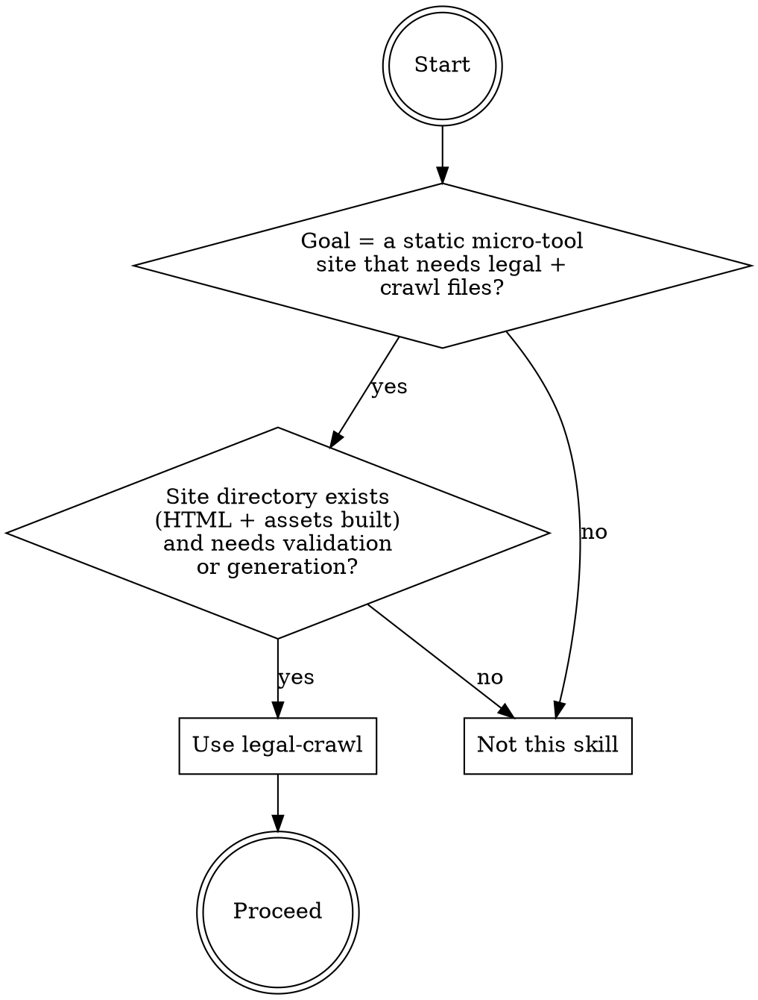
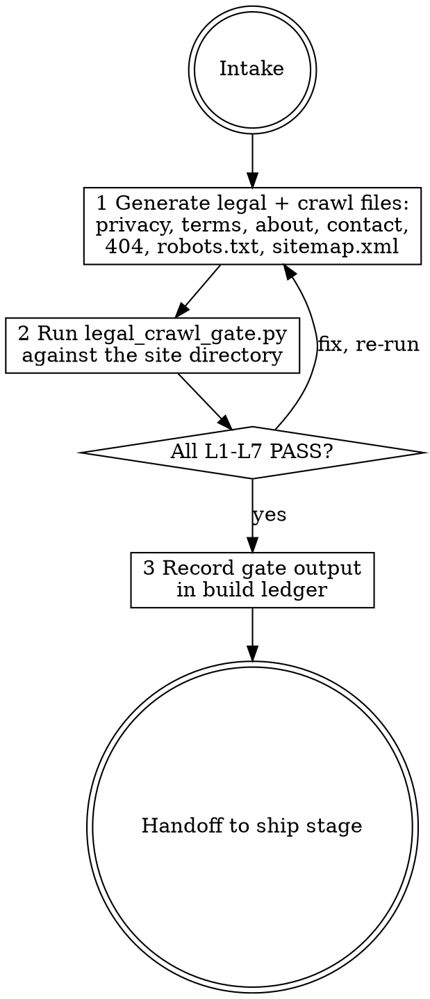

# legal-crawl

## Overview

Generates and validates the legal and crawl files a static micro-tool site needs before launch: a Privacy page, Terms page, About page, Contact page, a custom 404 page, robots.txt, and sitemap.xml — all personalized to the actual tool and brand, free of placeholders, interlinked from every page, and consistent with each other. The engine `scripts/legal_crawl_gate.py` runs seven fail-closed checks (L1–L7) against a site directory and exits 0 (PASS) or 1 (FAIL). The documented baseline failure this skill exists to prevent: a skill-less haiku agent delivered only 3 of the 4 required legal pages (silently dropping About), populated them with generic boilerplate dated "June 2024" and placeholder brand tokens, inconsistently linked only 3 of 4 legal pages in the footer and only 1 in the nav, placed a placeholder Formspree URL in the contact form, let the sitemap drift from the real file set, added nonexistent Disallow dirs to robots.txt, and self-assessed "not launch ready" only for infra reasons — never flagging the missing page or stale content as defects.

## When to use



## IRON LAWS

```
1. ALL FOUR LEGAL PAGES ARE REQUIRED — Privacy, Terms, About, and Contact pages
   must ALL be present. Silently dropping About (or any other page) because it
   seems optional is the verbatim baseline failure F1. The engine checks for all
   four by name and refuses the site if any is absent.

2. NO PLACEHOLDERS, NO BOILERPLATE, NO STALE DATES — every legal page must
   contain at least 150 visible words, must include the actual brand or tool name
   (personalization check), and must contain no placeholder markers (PLACEHOLDER,
   lorem ipsum, TODO, FIXME, double-brace template tokens, "[company", "[your"). Any legal page dated in
   the range 2020–(currentYear-1) adjacent to "updated" or "effective" is also
   refused. Shipping boilerplate with a 2024 date on a 2026 build is the verbatim
   baseline failure F2.

3. EVERY PAGE MUST LINK TO ALL FOUR LEGAL PAGES — every HTML page in the site
   (landing, tool pages, the legal pages themselves, and the 404 page) must contain
   an anchor link to each of the four legal pages. The baseline footer linked 3
   (missing About) and the header linked only Privacy (F3). Partial linking — three
   of four, or only in the footer — is a violation. Every page, all four links.

4. CONTACT MUST BE A REAL MECHANISM — the contact page must contain a working
   mailto: link with a real-looking email address, OR a form whose action is a
   non-empty, non-placeholder URL. The baseline used a formspree PLACEHOLDER action
   (F4). A form with action="#" or action containing PLACEHOLDER/example/TODO is
   refused.

5. CRAWL FILES MUST MATCH THE REAL SITE — robots.txt must contain a Sitemap: line
   whose URL ends in sitemap.xml, and must NOT contain a blanket "Disallow: /"
   that would block all crawlers. sitemap.xml must be well-formed XML with a
   urlset, must include a loc for every non-404 HTML page in the site, and every
   loc path must resolve to a file that actually exists. The baseline robots.txt
   invented nonexistent /admin/ and /private/ dirs, and the sitemap listed a stale
   page set that drifted from the actual files (F5, F6).

6. THE ENGINE IS FAIL-CLOSED WITH --selftest — every check in legal_crawl_gate.py
   has a bad fixture proving it refuses that failure mode. Running --selftest is
   mandatory before claiming any site is launch-ready. A site that has not been
   passed by the engine is not cleared for the ship stage, regardless of visual
   inspection or verbal assurance.
```

Violating the letter of these laws is violating the spirit. "The About page is optional for a single-tool micro-site" is a violation of Law 1.

## The loop



## Mandatory checklist

Announce: **"Using legal-crawl to generate and verify legal + crawl files."** Create a task item for EACH stage and complete them in order. Do not advance until the current stage is done and the gate has been run.

```
0. Intake — confirm the tool name, brand name, site domain, a real contact email
   or form endpoint, and the URL slug structure. If the contact mechanism is unknown
   STOP and ask — do not generate a contact page with a placeholder endpoint.

1. Generate — produce all seven artifacts in the site directory: privacy.html,
   terms.html, about.html, contact.html, 404.html, robots.txt, sitemap.xml.
   Every legal page must be personalized to the actual brand name. Every HTML
   page must link to all four legal pages. robots.txt must have a Sitemap: line.
   sitemap.xml must list every non-404 HTML page in the directory.

2. Gate run — run python3 scripts/legal_crawl_gate.py <site-dir>. All seven
   checks (L1-L7) must pass. If any FAIL: fix the issue, re-run until PASS.
   Paste the literal gate output into the build record.

3. Handoff — deliver the site directory with all legal+crawl files passing the
   gate. Report the literal gate output. Do NOT produce README.md, legal-notes.md,
   or any file beyond the seven required artifacts plus existing site files.
```

## Quick reference

| Check | Rule |
|---|---|
| L1 pages-present | privacy, terms, about, contact HTML + 404.html + robots.txt + sitemap.xml all present |
| L2 substance | each legal page >= 150 visible words, contains brand name, no placeholder markers |
| L3 double-linked | every HTML page has <a href> to all four legal pages |
| L4 no-stale-dates | no legal page shows year 2020-(currentYear-1) next to "updated" or "effective" |
| L5 robots-valid | robots.txt has Sitemap: ...sitemap.xml line; no blanket Disallow: / |
| L6 sitemap-matches | sitemap.xml well-formed XML urlset; every non-404 page has a loc; every loc file exists |
| L7 contact-real | contact page has mailto: with real address OR form with non-placeholder action |

`python3 scripts/legal_crawl_gate.py <site-dir>` — exit 0 PASS, 1 FAIL, 2 load error.
`--selftest` proves the engine refuses duds.

## Common rationalizations — STOP

| Excuse | Reality |
|---|---|
| "The About page is optional for a single-tool micro-site; Privacy/Terms/Contact are enough." | About is required unconditionally. The baseline silently dropped it and self-assessed 'not launch ready' for other reasons while never flagging its absence — verbatim baseline failure F1 (IRON LAW 1). |
| "I used standard boilerplate — it just needs the domain swapped at deploy time." | Legal pages with placeholder markers, wrong brand names, or a stale 2024 date are refused unconditionally. Personalization and date accuracy are checked before the gate passes (IRON LAW 2). |
| "The footer links to Privacy/Terms/Contact — three of four is good enough." | All four links from every page is the requirement. Three-of-four is the exact baseline failure F3. Partial linking does not satisfy Law 3 (IRON LAW 3). |
| "The Formspree URL can be filled in after launch." | A placeholder contact mechanism causes a gate FAIL. The contact must be real before the gate passes. Post-launch swaps are the baseline failure F4 (IRON LAW 4). |
| "The sitemap and robots.txt look reasonable — they don't need to match exactly." | sitemap.xml loc paths that reference missing files, and a blanket Disallow:/, both cause gate FAIL. "Looks reasonable" is not a machine check (IRON LAW 5). |
| "I've reviewed the files visually; running the gate is redundant." | Visual inspection is the documented failure mode. The gate is non-negotiable — paste its literal output into the build record before claiming the site is launch-ready (IRON LAW 6). |

## Red flags — you are rationalizing, start over

- You are writing legal pages and any of privacy, terms, about, or contact is still absent -> stage 1 (generate all four).
- Any legal page still contains PLACEHOLDER, lorem ipsum, TODO, FIXME, double-brace template tokens, "[company", or "[your" -> stage 1 (replace all placeholders with real content).
- Any HTML page in the site directory does not have links to all four legal pages -> stage 1 (add the missing links).
- The gate output is not pasted literally into your build record -> stage 2 (run the gate and paste output).
- robots.txt has Disallow: / or no Sitemap: line -> stage 1 (fix robots.txt).
- sitemap.xml lists a page that does not exist in the site dir, or a real page is missing from it -> stage 1 (sync the sitemap).

## Reference files

- `scripts/legal_crawl_gate.py` — the fail-closed engine (`--selftest` included).
- `evals/evals.json` — RED-GREEN behavioral evals (baseline failures this skill corrects).
