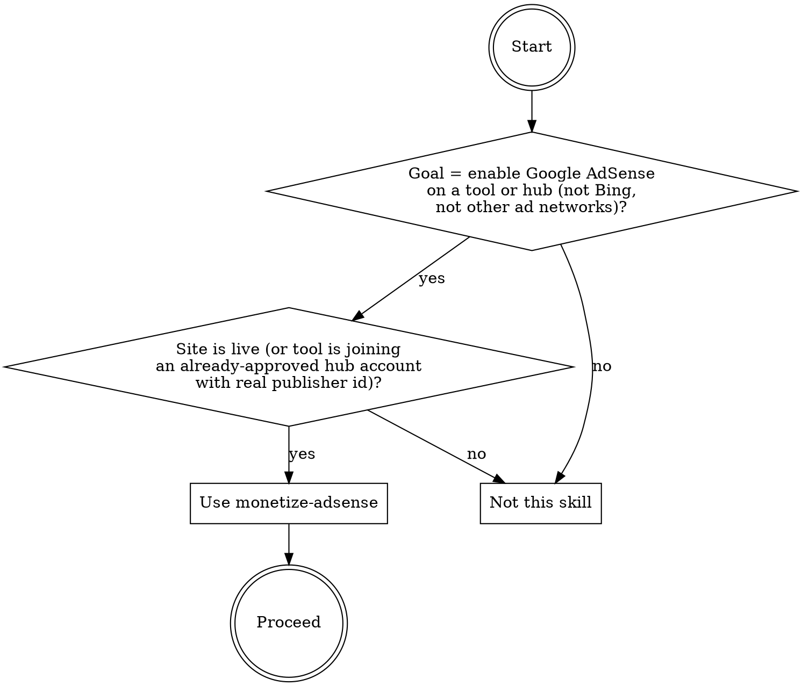
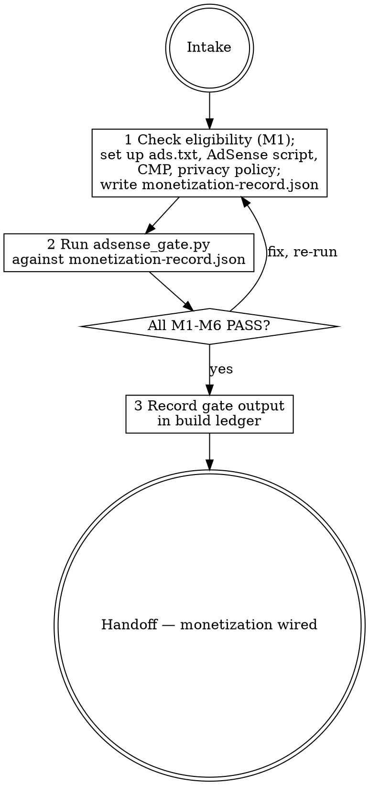

# monetize-adsense

## Overview

Governs the AdSense monetization setup for a micro-tool site or hub — enforcing the pre-application eligibility gate, verifying correct ads.txt format (pub- form, not ca-pub-), requiring an ads.txt-to-script publisher id match, requiring a Google-certified Consent Management Platform for EEA/UK consent, and requiring the privacy policy to disclose third-party ad cookies. The skill produces a structured `monetization-record.json` artifact; the engine `scripts/adsense_gate.py` validates that record against six fail-closed checks (M1–M6) and exits 0 (PASS) or 1 (FAIL). AdSense is applied once at the hub level; later tools joining an already-approved hub account skip the age/traffic eligibility gate (M1) but M2–M6 still apply. The gate inspects the JSON record only — it makes no network calls and requires no credentials.

**Limitation:** The gate validates the record's self-declarations only; a fabricated `days_live: 45` or `cmp.google_certified: true` will pass the gate. The agent must actually execute the eligibility assessment and setup steps before writing the record — do not write the record speculatively.

The documented baseline failure this skill exists to prevent: a skill-less haiku run on 2026-06-12 monetized prematurely and incompletely: it added the AdSense loader immediately to a 0-day-old, zero-traffic site while citing the stale myth that AdSense "requires a minimum 6 months of age" (the real threshold is ~30 days + real traffic + content + legal). It set up no Consent Management Platform despite Google's 2024-01-16 requirement. It wrote `ads.txt` with the `ca-pub-` prefix instead of the required `pub-` form, producing an invalid ads.txt. It used the placeholder `ca-pub-XXXXXXXXXXXXXXXX` in both files, not a real publisher id.

## When to use



## IRON LAWS

```
1. APPLY ONLY AFTER ELIGIBILITY IS MET — premature application is the #1 AdSense
   rejection cause. Unless eligibility.hub_approved is true (tool joining an
   already-approved hub), the site must be live for at least ~30 days, have at
   least ~10 daily users, have original content, and have legal pages present.
   The baseline applied immediately on a 0-day, zero-traffic site and cited the
   false 6-month myth — that myth is wrong and citing it produces premature submissions.
   hub_approved skips the age/traffic gate but M2–M5 still apply.

2. ADS.TXT MUST USE THE PUB- FORM — the correct AdSense ads.txt line is:
   'google.com, pub-<16 digits>, DIRECT, f08c47fec0942fa0' using the pub- form.
   Using ca-pub- in ads.txt is the documented baseline bug and produces an invalid
   ads.txt that ad exchanges will reject. The script tag uses ca-pub-; ads.txt uses
   pub-; they are the same publisher id, different conventional forms.

3. PUBLISHER ID MUST BE REAL AND MATCH ACROSS ADS.TXT AND SCRIPT — both
   ads_txt.line and adsense_script.client must use the same real 16-digit publisher
   id. A placeholder (all-X, all-zero) is refused. A mismatch between ads.txt and
   the script means the ad code and the ads.txt point to different accounts, so
   neither will work correctly. The baseline used a placeholder id in both files.

4. A GOOGLE-CERTIFIED CMP IS REQUIRED — Google requires a certified Consent
   Management Platform to serve ads to EEA/UK users, effective 2024-01-16. A site
   without a CMP or with a non-certified CMP cannot serve personalized ads to those
   users. The baseline set up no CMP at all; the agent admitted "I did not consider
   CMP compliance at all" — that record fails M4.

5. PRIVACY POLICY MUST DISCLOSE THIRD-PARTY AD COOKIES — AdSense program policy
   requires the site's privacy policy to explicitly disclose that third-party
   advertising cookies are used (e.g. by Google AdSense). A privacy policy that
   omits this is a policy violation. The baseline happened to get this right; the
   gate enforces it explicitly so it cannot be missed.

6. THE ENGINE IS FAIL-CLOSED WITH SELFTEST — run
   'python3 scripts/adsense_gate.py <monetization-record.json>' and paste the
   literal gate output into the build record before claiming the setup is complete.
   A verdict issued without running the gate violates this law. The gate inspects
   the record; do not write the record speculatively as a plan.
```

Violating the letter of these laws is violating the spirit. "I added the AdSense script on launch day because the site will grow — the 6-month rule is a myth so there is no real threshold" is a violation of Law 1.

## The loop



## Mandatory checklist

Announce: **"Using monetize-adsense to wire up AdSense monetization."** Create a task item for EACH stage and complete them in order. Do not advance until the current stage is done and gate output is pasted.

```
0. Intake — confirm whether this is a first/new application or a later tool joining
   an already-approved hub. For a new application: confirm days_live >= 30,
   daily_users >= 10, legal pages present, original content. Do NOT proceed with a
   new application for a 0-day site — the 6-month rule is a myth but ~30 days of
   real traffic is the real bar. For hub-approved: confirm the real publisher id.

1. Execute setup — (a) assess eligibility and record in the eligibility object;
   (b) write the ads.txt file with the exact line:
   'google.com, pub-<real-16-digits>, DIRECT, f08c47fec0942fa0' (pub- form, NOT ca-pub-);
   (c) add the AdSense script loader with client="ca-pub-<same-16-digits>";
   (d) deploy a Google-certified CMP and record cmp.enabled: true,
   cmp.google_certified: true; (e) confirm the privacy policy discloses third-party
   ad cookies and record privacy.discloses_ad_cookies: true;
   (f) write monetization-record.json with fields: tool, date (ISO 8601), eligibility,
   ads_txt, adsense_script, cmp, privacy. Do NOT include real_setup_done: false or
   submission_type: premature/plan — those mark the record as unexecuted.

2. Gate run — run python3 scripts/adsense_gate.py <monetization-record.json>. All
   six checks (M1–M6) must pass. If any FAIL: fix the underlying issue (correct the
   setup or the record), update monetization-record.json, and re-run the gate.
   Paste the literal gate output into the build record.

3. Handoff — deliver monetization-record.json and the literal gate output. Note that
   AdSense approval is asynchronous — the gate confirms the setup was DONE and RECORDED
   correctly; it cannot confirm Google has reviewed and approved the account yet.
   First-time applications typically take days to weeks for Google's review.
```

## Quick reference

| Check | Rule |
|---|---|
| M1 ELIGIBILITY-GATE | hub_approved skips age/users; otherwise days_live >= 30 AND daily_users >= 10 AND legal_pages_present AND has_original_content |
| M2 ADS-TXT-FORMAT | line matches 'google.com, pub-<16 digits>, DIRECT, f08c47fec0942fa0'; no ca-pub-; real id |
| M3 SCRIPT-CLIENT-MATCH | client = ca-pub-<16 digits>; real id; 16 digits equal ads.txt pub digits |
| M4 CMP-CERTIFIED | cmp.enabled === true AND cmp.google_certified === true |
| M5 PRIVACY-DISCLOSES | privacy.discloses_ad_cookies === true |
| M6 RECORD-REAL-EXECUTED | tool + date present; no real_setup_done: false; no plan-tier submission_type or status |

`python3 scripts/adsense_gate.py <monetization-record.json>` — exit 0 PASS, 1 FAIL, 2 load error.
`--selftest` proves the engine refuses duds.

## Common rationalizations — STOP

| Excuse | Reality |
|---|---|
| "I added the AdSense script on day 0 — the 6-month rule is a myth anyway, so there is no real threshold." | There is a real threshold: ~30 days live with ~10 daily users plus content and legal pages. Citing the 6-month myth to justify a 0-day application is the documented baseline failure — it refutes the myth and then ignores the real bar. Premature applications are rejected (IRON LAW 1). |
| "I wrote ads.txt with 'ca-pub-XXXXXXXXXXXXXXXX' — the ca-pub- form is just another notation for the same account." | ads.txt must use the pub- form (without 'ca-'). Using ca-pub- in ads.txt is the documented malformed-line baseline bug. The script uses ca-pub-; ads.txt uses pub-; both must use the same real publisher id (IRON LAW 2). |
| "The publisher id placeholder in the script and ads.txt is fine — we will replace it before going live." | A placeholder is a plan, not a setup. The gate refuses any record with a placeholder id (all-X, all-zero) in ads.txt or the script. A mismatch between the two also fails (IRON LAW 3). |
| "I did not set up a CMP — that is an EU-only concern and most of our traffic is US." | Google requires a certified CMP for ALL AdSense publishers to serve personalized ads to any EEA/UK user. There is no US-only exemption. The baseline admitted 'I did not consider CMP compliance at all' — that is the verbatim failure M4 exists to prevent (IRON LAW 4). |
| "I wrote monetization-record.json as a plan with the steps to follow — that counts as setup." | A plan serialized as JSON is not an executed setup record. The baseline wrote a record with real_setup_done: false and status: premature. Only write the record after the setup is complete (IRON LAW 6). |
| "I reviewed the setup manually — running the gate is redundant." | Visual inspection is the documented failure mode. The gate is non-negotiable; paste its literal output into the build record (IRON LAW 6). |

## Red flags — you are rationalizing, start over

- monetization-record.json contains real_setup_done: false or submission_type: premature/plan -> stage 1 (execute the setup, then write the record).
- ads_txt.line contains 'ca-pub-' anywhere -> stage 1 (rewrite with the pub- form: 'google.com, pub-<digits>, DIRECT, f08c47fec0942fa0').
- adsense_script.client digits differ from ads_txt.line pub digits -> stage 1 (they must be the same 16-digit publisher id).
- eligibility.days_live < 30 and hub_approved is not true -> stage 0 (do not apply yet; wait until the site has ~30 days of traffic).
- cmp.enabled or cmp.google_certified is false or missing -> stage 1 (deploy a Google-certified CMP before applying).
- Gate output is not pasted literally into the build record -> stage 2 (run the gate and paste output).

## Reference files

- `scripts/adsense_gate.py` — the fail-closed engine (`--selftest` included).
- `evals/evals.json` — RED-GREEN behavioral evals (baseline failures this skill corrects).
