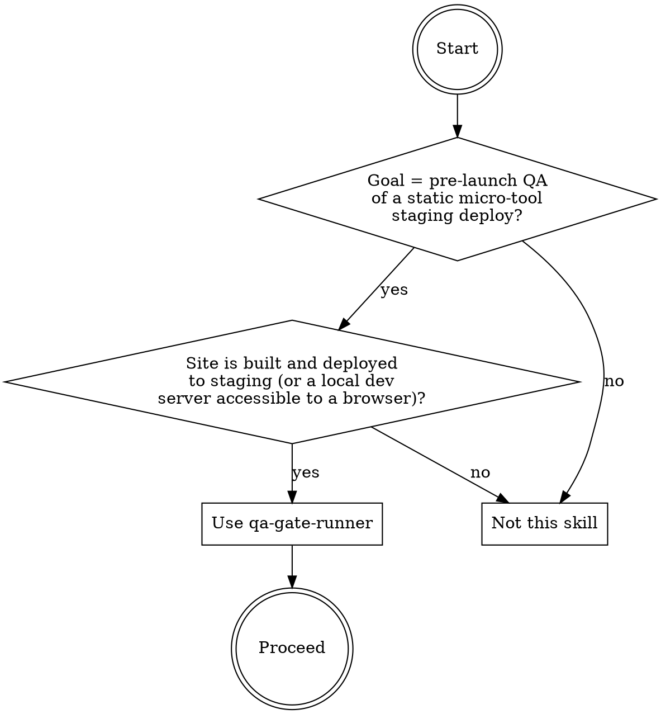
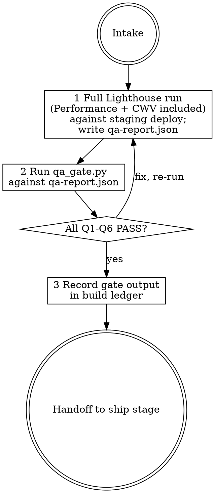

# qa-gate-runner

## Overview

Validates a structured qa-report.json produced by a real Lighthouse pass (including Performance) against the six pre-launch quality gates: all four Lighthouse categories >= 95, green Core Web Vitals, zero console errors, valid and allowed-only structured data, and a complete non-fabricated report artifact. The engine `scripts/qa_gate.py` runs six fail-closed checks (Q1-Q6) against the JSON report and exits 0 (PASS) or 1 (FAIL). It inspects the report file only — it does NOT run a browser, make network calls, or require credentials. The skill directs the agent to run a real full Lighthouse pass (including Performance and a performance trace for CWV) against the staging deploy and write qa-report.json before invoking the gate.

The documented baseline failure this skill exists to prevent: a skill-less haiku run on 2026-06-12 ran a real Lighthouse audit but (QA-F1) used a tool that "excludes performance" — so Performance was "Not measured" yet a go/no-go verdict was issued; (QA-F2) Core Web Vitals (LCP/CLS/INP) were "Not captured by testing environment"; (QA-F3) the deliverable was a prose QA_REPORT.md not a machine-readable report a gate could verify; (QA-F4) the schema section recommended adding FAQPage and HowTo — both dead/banned rich-result types (FAQ ended May 2026, HowTo Sept 2023); (QA-F5) accessibility scored 91 (below the 95 threshold); the baseline issued a partial-run verdict and conflated "unable-to-measure" with "measured-and-failed".

## When to use



## IRON LAWS

```
1. A QA REPORT MUST BE COMPLETE OR IT IS NOT A QA RUN — the qa-report.json must
   include all four Lighthouse category scores (performance, accessibility,
   best_practices, seo) for every page, a cwv block with lcp_ms/cls/inp_ms, a
   console_errors list, and a schema block. A missing or null Performance score
   (e.g. because the audit tool excluded it) makes the entire report non-gate-able.
   The baseline issued a go/no-go verdict with Performance "Not measured" — that is
   not a QA run, it is a partial check. Partial checks must be refused.

2. CORE WEB VITALS MUST BE GREEN AND PRESENT — every page must report numeric
   lcp_ms, cls, and inp_ms in the green range (LCP <= 2500 ms, CLS <= 0.1,
   INP <= 200 ms). "Not captured by testing environment" is not acceptable — if the
   measurement tool cannot capture CWV, use a different tool (e.g. a performance
   trace). The baseline left CWV entirely unmeasured and issued a verdict anyway.

3. THE REPORT IS A STRUCTURED MACHINE-READABLE ARTIFACT — the gate input must be
   a qa-report.json conforming to the schema: top-level tool and date fields, a
   pages list with per-page lighthouse/cwv/console_errors/schema objects. A prose
   QA_REPORT.md, a markdown summary, or a chat message is not a gate artifact and
   must be refused. The baseline produced a QA_REPORT.md that could not be verified
   by any automated gate.

4. SCHEMA IS ALLOWED TYPES ONLY — FAQPage AND HowTo ARE BANNED — each page's
   structured data may only use types from {SoftwareApplication, BreadcrumbList}.
   FAQPage rich results ended May 2026 and HowTo rich results ended September 2023;
   recommending or implementing either type wastes dev time and misleads users.
   schema.valid must be true. The baseline recommended adding both FAQPage and HowTo
   — stale, banned advice that the gate unconditionally refuses.

5. EVERY LIGHTHOUSE CATEGORY MUST SCORE >= 95 — performance, accessibility,
   best_practices, and SEO must all score >= 95 on mobile Lighthouse. Any score
   below 95 is a hard blocker. The baseline measured accessibility at 91 and used
   that partial reading as part of a verdict — a failing score is a FAIL, not a
   caveat. Name the page, category, and score in every failure message.

6. THE ENGINE IS FAIL-CLOSED WITH SELFTEST — the gate executable must refuse any
   report that is missing, non-JSON, structurally incomplete, or below threshold.
   "Looks good enough" visual inspection of a QA_REPORT.md is the documented
   failure mode; the gate is non-negotiable. Run `python3 scripts/qa_gate.py
   <qa-report.json>` and paste the literal output into the build record. A verdict
   issued without running the gate violates this law.
```

Violating the letter of these laws is violating the spirit. "Performance was 'excluded' by the audit tool but the other three categories look fine — I'll call it ready" is a violation of Law 1.

## The loop



## Mandatory checklist

Announce: **"Using qa-gate-runner to run the pre-launch QA gates."** Create a task item for EACH stage and complete them in order. Do not advance until the current stage is done and the gate has been run.

```
0. Intake — confirm the staging URL, confirm that the Lighthouse run will include
   Performance (NOT use a tool variant that excludes it), and confirm that CWV
   (LCP/CLS/INP) can be measured. If the only available tool excludes Performance,
   STOP — use a performance trace (e.g. performance_start_trace) to capture CWV
   and supplement the lighthouse scores from a separate full Lighthouse call that
   includes performance. Do not proceed with a partial audit.

1. Full measurement run — run a real full Lighthouse pass against the staging deploy
   including Performance. Use performance_start_trace or an equivalent to capture
   Core Web Vitals (lcp_ms, cls, inp_ms). Check the browser console for errors.
   Inspect the page's structured data types. Write qa-report.json with the exact
   schema: top-level tool (e.g. "lighthouse") and date (ISO 8601), pages list where
   each page has url, lighthouse (all 4 scores), cwv (lcp_ms, cls, inp_ms), a
   console_errors list (empty if none), and schema (types list + valid boolean).

2. Gate run — run python3 scripts/qa_gate.py <qa-report.json>. All six checks
   (Q1-Q6) must pass. If any FAIL: fix the underlying site issue or measurement
   gap, re-run the Lighthouse pass, update qa-report.json, and re-run the gate.
   Paste the literal gate output into the build record.

3. Handoff — deliver qa-report.json and the literal gate output. Do NOT produce
   QA_REPORT.md, summary.md, or any prose report alongside the JSON. The next stage
   (ship) needs the gate output and the staging URL. Report any known limitations
   (e.g. INP measured in lab mode — CrUX field data may differ at launch).
```

## Quick reference

| Check | Rule |
|---|---|
| Q1 REPORT-COMPLETE | pages non-empty; each page has lighthouse (all 4 scores 0-100), cwv, console_errors list, schema object |
| Q2 LIGHTHOUSE-THRESHOLD | performance, accessibility, best_practices, seo all >= 95 per page |
| Q3 CWV-GREEN | lcp_ms <= 2500, cls <= 0.1, inp_ms <= 200; all present as numbers |
| Q4 ZERO-CONSOLE-ERRORS | console_errors list is empty on every page |
| Q5 SCHEMA-ALLOWED-ONLY | schema.types subset of {SoftwareApplication, BreadcrumbList}; no FAQPage/HowTo; schema.valid = true |
| Q6 REPORT-IS-REAL | tool (string) + date/timestamp present; >= 1 page with a url |

`python3 scripts/qa_gate.py <qa-report.json>` — exit 0 PASS, 1 FAIL, 2 load error.
`--selftest` proves the engine refuses duds.

## Common rationalizations — STOP

| Excuse | Reality |
|---|---|
| "Performance was excluded by the audit tool but the other categories all look good — that's enough for a launch call." | A QA run without Performance is not a QA run. The baseline excluded Performance and issued a go/no-go verdict anyway — exactly what Law 1 was written to prevent (IRON LAW 1). |
| "CWV wasn't captured by the testing environment — it's fine, we'll monitor post-launch." | 'Not captured' is a FAIL. The baseline left LCP/CLS/INP unmeasured and still issued a verdict. Use a performance trace if the lighthouse tool cannot capture CWV (IRON LAW 2). |
| "I wrote a QA_REPORT.md with all the findings — it's easier for humans to read." | A prose markdown report cannot be verified by a gate. The baseline produced a QA_REPORT.md and no machine-readable artifact. The gate requires qa-report.json (IRON LAW 3). |
| "The schema section suggests adding FAQPage for better rich results." | FAQPage rich results ended May 2026. HowTo ended September 2023. The baseline recommended both — stale advice that the gate unconditionally refuses (IRON LAW 4). |
| "Accessibility scored 91 — it's close to 95 and we can fix it post-launch." | A score below 95 is a hard blocker, not a near-miss. The baseline measured accessibility 91 and still attempted a launch verdict (IRON LAW 5). |
| "I reviewed the QA_REPORT.md visually and it looks solid — running the gate is redundant." | Visual inspection of a prose report is the documented failure mode. The gate is non-negotiable; paste its literal output into the build record (IRON LAW 6). |

## Red flags — you are rationalizing, start over

- Any Lighthouse run that "excludes performance" or leaves Performance as "Not measured" in the report -> stage 1 (re-run with Performance included).
- cwv object missing or any of lcp_ms/cls/inp_ms is absent or null -> stage 1 (use performance trace to capture CWV).
- The QA deliverable is QA_REPORT.md or a prose summary instead of qa-report.json -> stage 1 (re-run and write the JSON schema).
- schema.types contains FAQPage or HowTo -> stage 1 (remove banned types; use SoftwareApplication and BreadcrumbList only).
- Any Lighthouse score is below 95 -> stage 1 (fix the issue and re-run the full audit).
- Gate output is not pasted literally into your build record -> stage 2 (run the gate and paste output).

## Reference files

- `scripts/qa_gate.py` — the fail-closed engine (`--selftest` included).
- `evals/evals.json` — RED-GREEN behavioral evals (baseline failures this skill corrects).
