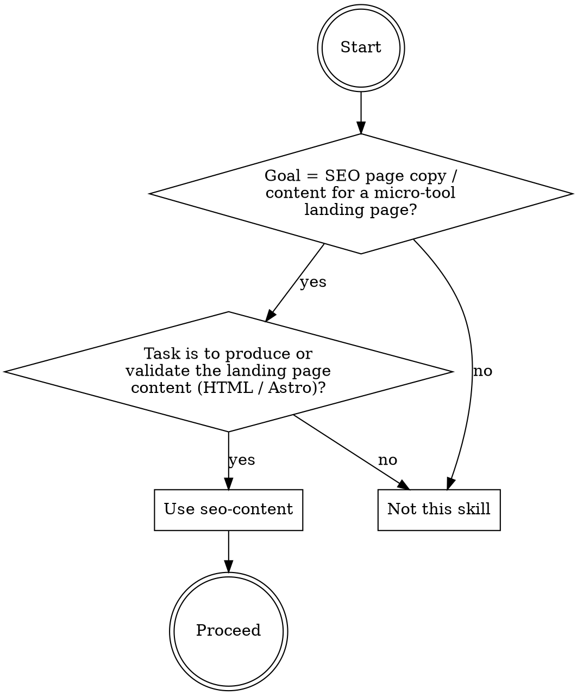
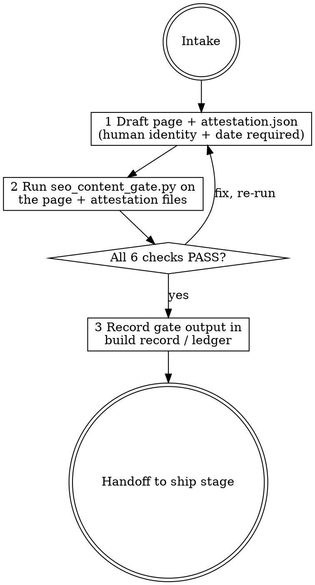

# seo-content

## Overview

Produces and validates the on-page SEO content package for a micro-tool landing page, then runs fail-closed checks via scripts/seo_content_gate.py. The skill emits an HTML or Astro page file plus a small JSON sidecar attestation file, and refuses to pass the content through until all six checks are green. The validated artifact replaces the informal process of an agent drafting copy, self-certifying "2,040+ words original content", and shipping a FAQPage JSON-LD block that Google removed from its rich-result program in May 2026. The documented baseline failure this skill exists to prevent: a skill-less haiku agent shipped FAQPage JSON-LD markup while citing a stale CTR uplift claim ("FAQPage Schema: 10 Q&A pairs qualify for rich snippets — 20-30% higher CTR"), sprawled eleven files including README.md (12 KB), SEO_CHECKLIST.md (9.1 KB), CONTENT_STRATEGY.md (11.5 KB), and DEPLOYMENT_GUIDE.md (11.1 KB) that were never requested, self-certified "Approval likelihood: HIGH" and "All files ready for deployment" with no machine check, claimed originality itself without any human attestation, and supplied zero internal cluster links to related tools (only legal-page links such as /privacy-policy.html and /terms-of-service.html).

## When to use



## IRON LAWS

```
1. NO FAQPage OR HowTo STRUCTURED DATA — EVER — Google removed FAQPage rich
   results in May 2026 and HowTo rich results in September 2023 (both
   re-verified 2026-06-10). Including these schema types in JSON-LD or microdata
   gains nothing and adds policy and maintenance risk. The engine checks for both
   and REFUSES the page if either is present. Saying "the CTR uplift is worth it"
   or "my source says they still work" is a violation — the removal is documented
   and the check is unconditional.

2. VISIBLE FAQ SECTION IS REQUIRED — while FAQPage JSON-LD is dead weight, a
   visible FAQ section with at least three question/answer pairs is still
   valuable for users and People-Also-Ask coverage. The engine checks that the
   page carries both an FAQ-style heading (containing "FAQ", "Frequently Asked",
   or "Common Questions") and at least three visible question/answer pairs as
   plain text; it refuses the page if either signal is absent. Hiding the FAQ in
   structured data and omitting the visible section is a double violation.
   Scattering rhetorical questions through body copy without an FAQ section
   heading does not satisfy this law.

3. HUMAN ORIGINALITY PASS — NO AGENT SELF-CERTIFICATION — AdSense's scaled-content
   policy explicitly covers AI-generated tool sites (verified 2026-06-10). An agent
   may draft the copy, but a named human must review, edit, and attest in a sidecar
   attestation.json with their identity and date before the gate passes. Attestations
   by "agent", "self", "assistant", "claude", "ai", "chatgpt", "gpt", "bot", "llm",
   "copilot", "gemini", or an empty identity are refused unconditionally (token-wise:
   a reviewer value like "Claude Fable agent run" is refused because it contains
   the token "claude"). Claiming "I wrote it originally" or "the copy is high quality"
   does not satisfy this law — a recorded human attestation with identity and date
   is the only acceptable evidence.

4. MINIMUM FLOORS — NO THINNING THE COPY — the landing page must contain at least
   600 original visible words (measured by stripping tags, script, style, and
   frontmatter), the HTML title must be 15-60 characters, the meta description must
   be 50-160 characters, and og:title plus og:description must both be present.
   Self-reporting word counts without running the check is a violation.

5. INTERNAL CLUSTER LINKS ARE REQUIRED — the page must contain at least two
   internal links pointing to related tool or content pages on the same site.
   Links to legal pages such as /privacy-policy, /terms-of-service, or /contact
   do NOT count toward this floor; only links to other tools, blog posts, or
   content hubs qualify. Listing legal-page links and claiming the requirement
   is met is a violation.

6. NO EXTRA FILES — DELIVER ONLY WHAT WAS ASKED — the skill produces a page file
   (HTML or Astro) and an attestation.json sidecar. It does not produce README.md,
   SEO_CHECKLIST.md, CONTENT_STRATEGY.md, DEPLOYMENT_GUIDE.md, og-image-spec.md,
   DELIVERABLES.txt, sitemap.xml, robots.txt, or any other uncharged artifact. Every
   extra file is a waste of time and a signal that the agent padded outputs to look
   thorough rather than running a gate.
```

Violating the letter of these laws is violating the spirit. "The FAQPage JSON-LD improves rich snippet eligibility and the CTR lift is worth the risk" is a violation of Law 1.

## The loop



## Mandatory checklist

Announce: **"Using seo-content to produce the landing page content package."** Create a task item for EACH stage and complete them in order. Do not advance until the current stage is done and the gate has been run.

```
0. Intake — confirm the tool name, target URL slug, at least two related tool URLs
   for cluster links, and the identity of the human who will perform the originality
   pass. If the human reviewer identity is unknown, STOP and ask — do not draft copy
   that cannot be attested.

1. Draft — produce the page file (index.html or index.astro) and a companion
   attestation.json with fields: reviewer (human identity, not "agent"), date
   (YYYY-MM-DD), and confirmed: false. Do not claim the copy is original in chat;
   only the attestation with confirmed: true counts.

2. Gate run (pre-attest) — run python3 scripts/seo_content_gate.py <page-file>
   <attestation.json>. Checks C1-C5 should pass. C6 will fail because confirmed is
   false or the reviewer identity has not been set. This is expected.

3. Human review — the named human reads the copy, edits as needed, and sets
   confirmed: true and date to today in attestation.json. Do not set confirmed
   yourself.

4. Gate run (final) — re-run the gate. All six checks must pass. Paste the literal
   output into the build record. Any FAIL: fix and rerun until PASS.

5. Handoff — deliver the page file and attestation.json only. Report the gate output
   and the human reviewer identity. Do not produce any additional files.
```

## Quick reference

| Check | Rule |
|---|---|
| C1 word-floor | Visible words (strip tags/script/style/frontmatter) >= 600 |
| C2 no-dead-schema | ZERO FAQPage or HowTo JSON-LD or microdata present |
| C3 visible-faq | FAQ-style heading ("FAQ", "Frequently Asked", or "Common Questions") AND >= 3 visible question/answer pairs (plain text) |
| C4 meta-completeness | Title 15-60 chars; meta description 50-160 chars; og:title and og:description present |
| C5 cluster-links | >= 2 internal links to non-legal pages (not /privacy, /terms, /contact) |
| C6 human-attestation | attestation.json has a non-agent reviewer identity, a date, and confirmed: true |

`python3 scripts/seo_content_gate.py <page-file> <attestation-file>` — exit 0 PASS, 1 FAIL, 2 load error.
`--selftest` proves the engine refuses duds.

## Common rationalizations — STOP

| Excuse | Reality |
|---|---|
| "FAQPage Schema: 10 Q&A pairs qualify for rich snippets — 20-30% higher CTR than standard links." | FAQPage rich results were removed by Google in May 2026 (re-verified 2026-06-10). This stale claim is the verbatim baseline failure. Zero rich-result benefit accrues; the check refuses unconditionally (IRON LAW 1). |
| "I wrote 2,040+ words of original, professional content — no human review needed." | AdSense's scaled-content policy explicitly covers AI tool sites. Claiming originality in chat proves nothing and satisfies no check. A named human with identity + date in attestation.json is the only valid evidence (IRON LAW 3). |
| "The word count exceeds 2,000 words so the floor is definitely met." | Self-reported counts without running the gate are unverified. The check strips tags/script/style/frontmatter and counts mechanically — run it (IRON LAW 4). |
| "I included /privacy-policy.html and /terms-of-service.html links — that is two internal links." | Legal-page links are explicitly excluded from the cluster-link floor. Only links to related tools, blog posts, or content hubs count (IRON LAW 5). |
| "A README and deployment guide make the package more complete." | The baseline sprawled eleven files nobody asked for. The deliverable is a page file and an attestation sidecar — nothing else (IRON LAW 6). |
| "Approval likelihood: HIGH — all files ready for deployment." | Self-certification with no gate run is the exact failure this skill exists to prevent. The gate output, not a chat claim, is the evidence (IRON LAW 3, IRON LAW 4). |

## Red flags — you are rationalizing, start over

- You are writing page copy and attestation.json still has confirmed: false or reviewer identity is "agent" -> stage 3 (human review required first).
- You produced a README.md, SEO_CHECKLIST.md, CONTENT_STRATEGY.md, or any file not in {page file, attestation.json} -> stage 5 (delete the extra files).
- Your word count is a claim in chat rather than gate output -> stage 4 (run the gate).
- The page contains FAQPage or HowTo JSON-LD regardless of the justification -> stage 1 (remove the schema block).
- The only internal links on the page go to /privacy-policy, /terms-of-service, or /contact -> stage 1 (add cluster links to related tools).
- The gate output is not pasted literally into your build record -> stage 4 (paste it).

## Reference files

- `scripts/seo_content_gate.py` — the fail-closed engine (`--selftest` included).
- `evals/evals.json` — RED-GREEN behavioral evals (baseline failures this skill corrects).
