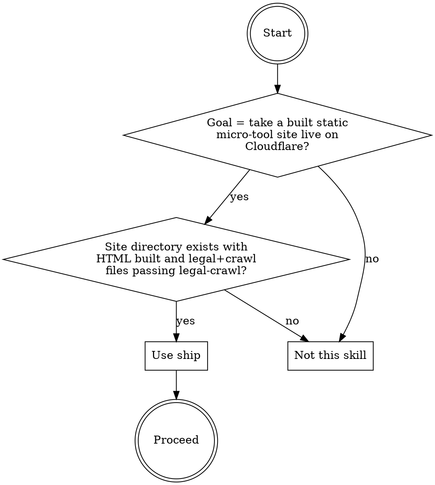
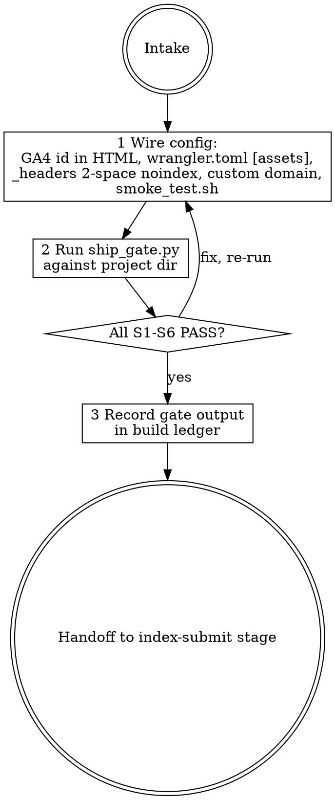

# ship

## Overview

Takes a built, gate-passed, legal-complete static micro-tool site and validates the full set of Cloudflare deployment config artifacts needed to go live: a real GA4 analytics id in every HTML file, a current Workers static-assets wrangler config (not the deprecated Workers Sites layout), no unfilled placeholder tokens in any config file, a _headers file with exact two-space indentation for the staging noindex rule, a production custom domain route, and a smoke-check artifact that asserts the three minimum post-deploy checks. The engine `scripts/ship_gate.py` runs six fail-closed checks (S1-S6) against the project directory and exits 0 (PASS) or 1 (FAIL). It inspects config files only — it does NOT perform a live deploy, make network calls, or require credentials.

The documented baseline failure this skill exists to prevent: a skill-less haiku run produced a plausible-looking ship config with six real defects: the analytics snippet hardcoded G-XXXXXXXXXX in every HTML file, wrangler.toml used the deprecated Workers Sites layout with [site] bucket and [[build.upload_rules]], the config left YOUR_ZONE_ID as a literal placeholder, the _headers noindex rule relied on host-prefixed path blocks whose Cloudflare scoping was never verified and whose indentation was not checked, no custom domain was confirmed, and the agent self-assessed the config as "complete, vetted, production-grade" — never flagging the deprecated wrangler syntax or the unverified noindex as defects.

## When to use



## IRON LAWS

```
1. ANALYTICS MUST BE A REAL GA4 ID — every HTML file must contain a GA4 gtag
   snippet with a measurement id matching G-[A-Z0-9]{6,} that is NOT the
   placeholder G-XXXXXXXXXX or any all-X run. The baseline hardcoded
   G-XXXXXXXXXX in both index.html and calculator.html — deploying with it means
   zero analytics data is ever collected. The engine refuses any all-X id
   unconditionally.

2. DEPLOY TARGET MUST BE CURRENT WORKERS STATIC ASSETS — a wrangler.toml (TOML
   format only) must declare [assets] with a directory field and must NOT use the
   deprecated Workers Sites layout ([site] table, [[build.upload_rules]], or
   CompiledContentAssets). The baseline used [site] bucket and upload_rules, which
   is the old Cloudflare Workers Sites model — it will not deploy on the intended
   Workers-static-assets target. The gate validates wrangler.toml only; jsonc/json
   configs use different syntax and are not validated here. Deprecated config that
   looks correct is more dangerous than obviously wrong config.

3. NO UNFILLED PLACEHOLDER TOKENS IN ANY CONFIG — no deploy or config file
   (wrangler.toml, _headers, smoke artifact) may contain YOUR_ZONE_ID,
   YOUR_ACCOUNT_ID, PLACEHOLDER, a bare XXXX run of four or more X's,
   <...>-style angle placeholders, or the copy-paste example domains
   yourdomain.com, example.com, or REPLACE_ME. The baseline left YOUR_ZONE_ID in
   the env blocks of wrangler.toml and called the config "complete, vetted." An
   unfilled placeholder (including a literal example domain) is a deploy-time
   failure waiting to happen.

4. STAGING NOINDEX REQUIRES EXACT TWO-SPACE INDENTATION IN _HEADERS — the
   _headers file must exist, must contain an X-Robots-Tag: noindex rule that is
   correctly indented with EXACTLY two spaces UNDER a path rule, and EVERY header
   line under a path rule must be indented with EXACTLY two spaces — not a tab, not
   four spaces, and not zero (column-0). A column-0 X-Robots-Tag line is treated by
   Cloudflare as a PATH, not a header, so staging would NOT be noindexed — the exact
   catastrophe the skill exists to prevent. Production must NOT be noindexed via any
   top-level root path rule (/* or /). The baseline relied on host-prefixed path
   blocks without verifying indentation or scoping, and never caught that Cloudflare
   _headers matches URL paths, not origins.

5. PRODUCTION CUSTOM DOMAIN MUST BE DECLARED — the wrangler config must declare
   a production route or custom_domain pointing to a real domain, not only a
   *.workers.dev or *.pages.dev subdomain. Shipping to workers.dev as the only
   reachable address is not shipping to production. The baseline put a route block
   but with a placeholder zone_id (already covered by Law 3); this law catches the
   additional case where the route is absent entirely.

6. SMOKE CHECK BEFORE CLAIMING SHIPPED — a smoke-check artifact must exist and
   must assert all three minimum conditions: production URL returns 200, staging
   responds with X-Robots-Tag: noindex, and production is NOT noindexed. The
   prod-not-noindexed assertion must invoke curl against the production URL — a
   comment merely mentioning "not noindexed" does not satisfy this law. The
   baseline wrote a smoke file but self-assessed "not shipped" only for credential
   blockers while calling the config "production-grade" — never running the smoke
   check against its own defects. A smoke manifest that does not cover all three
   conditions is not a smoke check.
```

Violating the letter of these laws is violating the spirit. "The GA4 id just needs to be swapped in at deploy time; the placeholder is fine for config review" is a violation of Law 1.

## The loop



## Mandatory checklist

Announce: **"Using ship to wire and validate the Cloudflare deploy config."** Create a task item for EACH stage and complete them in order. Do not advance until the current stage is done and the gate has been run.

```
0. Intake — confirm the GA4 property measurement id (must be a real G-... id from
   the GA4 console, not a placeholder), the production domain, the staging host
   or path prefix, and a real contact for the Cloudflare account. If the GA4 id
   is unknown, STOP and ask — do not write a config with G-XXXXXXXXXX.

1. Wire — produce or update all required config artifacts in the project dir:
   - Every HTML file: add GA4 gtag snippet with the real measurement id.
   - wrangler.toml: [assets] directory = './dist' (or your built output dir);
     [[routes]] pointing to the real production domain; NO [site] table or
     [[build.upload_rules]]; no unfilled placeholder tokens.
   - _headers: staging noindex rule with EXACTLY two-space indentation (not tab,
     not four spaces). Production /* rule must NOT apply X-Robots-Tag: noindex.
   - smoke_test.sh: asserts (a) prod URL returns 200, (b) staging header
     includes X-Robots-Tag: noindex, (c) prod does NOT return X-Robots-Tag: noindex.

2. Gate run — run python3 scripts/ship_gate.py <project-dir>. All six checks
   (S1-S6) must pass. If any FAIL: fix the issue, re-run until PASS. Paste the
   literal gate output into the build record.

3. Handoff — deliver the project directory with all ship config files passing the
   gate. Report the literal gate output. Do NOT produce README.md, deploy-notes.md,
   or any file beyond the required config artifacts plus existing site files. The
   next stage (index-submit) needs the gate output and the production domain.
```

## Quick reference

| Check | Rule |
|---|---|
| S1 ANALYTICS-REAL | HTML file contains GA4 gtag with G-[A-Z0-9]{6,}, NOT G-XXXXXXXXXX or all-X |
| S2 DEPLOY-TARGET-CORRECT | wrangler.toml (TOML only) has [assets] directory; no [site]/upload_rules/CompiledContentAssets |
| S3 NO-PLACEHOLDER-CONFIG | no YOUR_ZONE_ID, YOUR_ACCOUNT_ID, PLACEHOLDER, XXXX+, angle placeholders, yourdomain.com, example.com, or REPLACE_ME in config files |
| S4 STAGING-NOINDEX-EXACT | _headers exists; X-Robots-Tag: noindex correctly 2-space-indented under a path rule (not column-0); all header lines exactly two spaces; no top-level /* or / noindex |
| S5 CUSTOM-DOMAIN | wrangler config declares route/[[routes]]/custom_domain with a real domain |
| S6 SMOKE-MANIFEST | smoke artifact asserts prod 200 + staging noindex + prod NOT noindexed (prod check must use curl, not a comment) |

`python3 scripts/ship_gate.py <project-dir>` — exit 0 PASS, 1 FAIL, 2 load error.
`--selftest` proves the engine refuses duds.

## Common rationalizations — STOP

| Excuse | Reality |
|---|---|
| "The GA4 id is just a placeholder — it will be swapped at deploy time; the rest of the config is reviewable now." | A GA4 placeholder deploys to no analytics data ever collected. The baseline hardcoded G-XXXXXXXXXX in both HTML files and called the config 'complete, vetted, production-grade' (IRON LAW 1). |
| "The old Workers Sites wrangler config style still works; I can migrate later." | Workers Sites ([site] + [[build.upload_rules]]) is the deprecated target — it will NOT deploy on Workers-static-assets. The baseline used it verbatim and the agent never flagged it as wrong (IRON LAW 2). |
| "The _headers noindex rule is correct — the host-prefixed path block scopes it to staging." | Cloudflare _headers matches URL paths, not origins. Mis-indented rules (tabs or four spaces) are silently ignored, leaving staging fully indexed. The baseline never verified indentation or scoping (IRON LAW 4). |
| "YOUR_ZONE_ID just needs the real zone id filled in — the config structure is correct." | An unfilled placeholder is a deploy-time failure. The baseline left YOUR_ZONE_ID in both env blocks and called the config 'complete' (IRON LAW 3). |
| "The smoke check covers the main production path — I can add the staging noindex check post-launch." | A smoke check missing the staging noindex assertion does not verify that staging is noindexed. The baseline smoke file self-assessed 'not shipped' only for credential reasons while never running its own smoke checks (IRON LAW 6). |
| "I've reviewed all config files visually; running the gate is redundant." | Visual inspection is the documented failure mode — the baseline produced six defects via visual review alone. The gate is non-negotiable (IRON LAW 6). |

## Red flags — you are rationalizing, start over

- Any HTML file still contains G-XXXXXXXXXX or a GA4 id with an all-X suffix -> stage 1 (add real measurement id).
- wrangler.toml contains [site] or [[build.upload_rules]] or CompiledContentAssets -> stage 1 (migrate to [assets]).
- Any config file contains YOUR_ZONE_ID, YOUR_ACCOUNT_ID, PLACEHOLDER, or XXXX+ -> stage 1 (fill all placeholders).
- The _headers file uses tab, four-space, or zero (column-0) indentation for header values -> stage 1 (fix to exactly two spaces under a path rule).
- Any config file contains yourdomain.com, example.com, or REPLACE_ME -> stage 1 (replace with the real domain/value).
- The gate output is not pasted literally into your build record -> stage 2 (run the gate and paste output).
- No smoke-check artifact exists, or it does not assert staging noindex and prod 200, or the prod-not-noindexed check is only a comment -> stage 1 (create or fix smoke_test.sh).

## Reference files

- `scripts/ship_gate.py` — the fail-closed engine (`--selftest` included).
- `evals/evals.json` — RED-GREEN behavioral evals (baseline failures this skill corrects).
