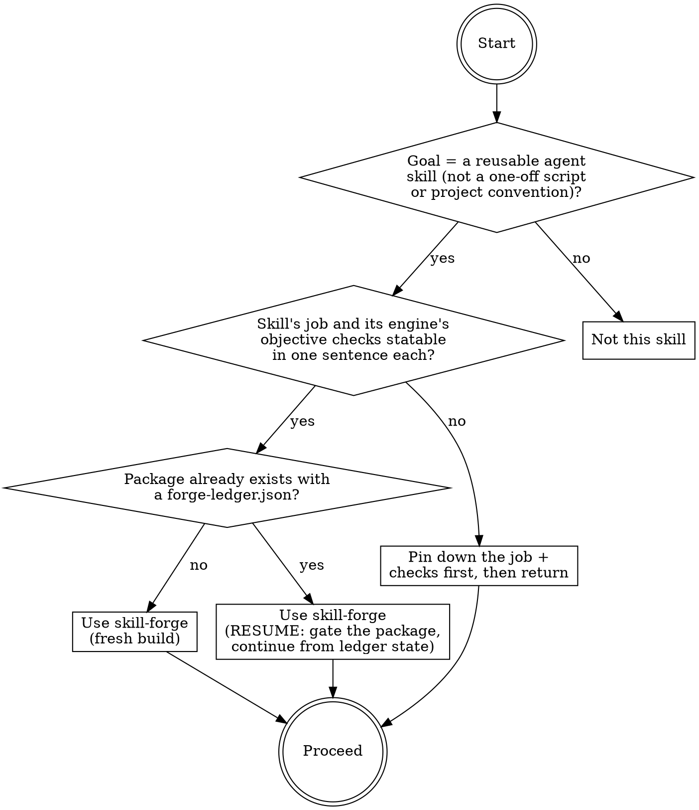
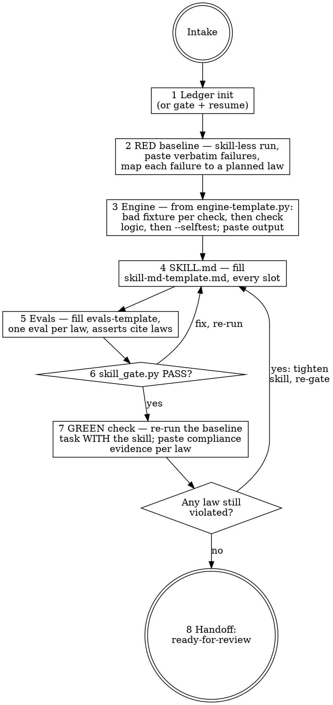

# skill-forge

## Overview

Builds a complete house-standard skill package — SKILL.md, fail-closed engine with
`--selftest`, behavioral evals, and a forge-ledger.json evidence record — by following
templates mechanically. The intelligence is in the templates and this checklist, not in
you: copy each template, fill every slot, paste literal command output as evidence, and
let `scripts/skill_gate.py` tell you whether the package is acceptable. The documented
baseline failure this skill exists to prevent: an unaided agent produced a skill with no
frontmatter (it could never load), a trigger buried in body prose, 3595 lines across 15
files of unrequested documentation, no behavioral evals, no selftest, and a
self-certified "production ready" claim with zero verification.

## When to use



## IRON LAWS

```
1. NO SKILL WITHOUT A FAILING BASELINE FIRST — before writing SKILL.md, run
   (or dispatch) an agent on a realistic task WITHOUT the skill and paste its
   verbatim failures into the ledger. The baseline tells you what the laws,
   rationalization table, and evals must counter. No baseline = you are
   guessing what the skill needs to teach.

2. THE LEDGER IS THE BUILD — every stage closes by pasting literal command
   output or verbatim excerpts into forge-ledger.json. A chat summary is not
   evidence; the ledger is what skill-reviewer verifies and what survives
   the session.

3. FILL THE TEMPLATES, INVENT NOTHING STRUCTURAL — copy the bundled
   templates exactly, fill every double-brace slot, delete no required
   section, add no extra top-level files. The package is SKILL.md +
   scripts/ + references/ + evals/ + forge-ledger.json (plus assets/ and
   a .gitignore when genuinely needed). README, MANIFEST,
   INTEGRATION guides and friends are the documented baseline failure.

4. THE ENGINE IS FAIL-CLOSED WITH --selftest — every check the engine makes
   gets a bad fixture proving the engine REFUSES it, plus one mutation
   invariant. Run --selftest and paste the literal PASS line before calling
   the engine built. An engine that cannot demonstrate refusal is decoration.

5. EVERY LAW GETS AN EVAL FROM A REAL FAILURE — each IRON LAW in the new
   skill is cited by at least one eval assert, and each law's origin
   (baseline-failure or house-standard) is recorded in the ledger. Laws
   nobody tested are laws agents will rationalize around.

6. THE FORGE DOES NOT SHIP — finish at status "ready-for-review" and hand
   off to skill-reviewer. Never install, symlink, announce "production
   ready", or stamp your own review. The gate checks structure; only the
   reviewer checks honesty.
```

Violating the letter of these laws is violating the spirit. "The baseline would
obviously fail, I skipped running it" or "a README is helpful, not sprawl" is a
violation.

## The loop



## Mandatory checklist

Announce: **"Using skill-forge to build [skill-name]."** Create a TodoWrite item for
EACH stage and complete them in order. Do not advance until the current stage is done
and its ledger entry carries evidence.

```
0. Intake — write one sentence each: the skill's job, its trigger
   situations, and what its engine will objectively check. Pick a name
   (lowercase letters, digits, hyphens; must equal the directory name).
   If you cannot state the engine's checks objectively, STOP and ask.

1. Ledger — create <skill-dir>/forge-ledger.json from
   references/forge-ledger-template.md. If the package already exists, run
   scripts/skill_gate.py on it FIRST and resume from what the ledger says
   is done — never redo a stage that has evidence.

2. RED baseline — give a realistic task the skill will govern to an agent
   WITHOUT the skill (subagent if available; otherwise perform it yourself
   in a scratch directory, honestly, with no house knowledge applied).
   Paste verbatim failures into the ledger baseline stage. Write
   law_origins: every planned law maps to a baseline failure or a named
   house standard.

3. Engine — copy references/engine-template.py into scripts/<name>_gate.py
   (or _lint.py). For EACH check: write the bad fixture first, then the
   check logic that refuses it. Run `python3 scripts/<engine> --selftest`;
   paste the literal SELFTEST RESULT line into the ledger. Coverage floor:
   1 good, 3 bad, 1 invariant — more checks means more bad fixtures.

4. SKILL.md — copy references/skill-md-template.md, fill every slot,
   delete the instruction comments. Laws come from your law_origins map.
   Rationalization table rows come from the baseline's verbatim excuses.
   Frontmatter description starts "Use when", third person, triggers only
   — never summarize the workflow (agents follow the summary and skip
   the body).

5. Evals — copy references/evals-template.json to evals/evals.json. One
   eval per law minimum; every assert that enforces a law cites it as
   "(IRON LAW n)"; notes carry the verbatim baseline documentation.

6. Self-gate — run `python3 scripts/skill_gate.py <skill-dir>` (the copy
   bundled with skill-forge). Paste the output into the ledger self_gate
   stage even if it FAILs; fix and re-run until PASS, then update the
   excerpt to the passing run.

7. GREEN check — re-run the stage-2 baseline task WITH the new skill
   loaded. Paste evidence per law that the failure no longer happens. Any
   law still violated: tighten the skill (stage 4/5), re-gate, repeat.

8. Handoff — set status "ready-for-review". Report: package path, gate
   output, law count, eval count, known limitations. STOP. skill-reviewer
   (a stronger model or a human) takes it from here.
```

## Quick reference

| Artifact | Source template | Validated by |
|---|---|---|
| SKILL.md | references/skill-md-template.md | skill_gate.py F2, F3, F7 |
| scripts/<name>_gate.py | references/engine-template.py | F4 (executed live) |
| evals/evals.json | references/evals-template.json | F5 |
| forge-ledger.json | references/forge-ledger-template.md | F6 |
| Whole package layout | — | F1 (anti-sprawl) |

Engine: `python3 scripts/skill_gate.py <skill-dir>` — exit 0 PASS, 1 FAIL, 2 load
error. `--selftest` proves the gate refuses duds (floor: 1 good, 3 bad, 1 invariant).

## Common rationalizations — STOP

| Excuse | Reality |
|---|---|
| "The baseline would obviously fail; no need to run it." | The documented baseline produced 27 passing unit tests AND an unusable skill. You cannot predict failure modes — run it (IRON LAW 1). |
| "I'll describe the build in my summary; the ledger is bookkeeping." | Chat dies with the session. The reviewer verifies the ledger, not your memory (IRON LAW 2). |
| "A README and an integration guide make the skill more complete." | 15-file sprawl is the baseline failure. SKILL.md IS the documentation (IRON LAW 3). |
| "The engine works; selftest is redundant." | An engine that never demonstrated refusing a dud is untested. Bad fixtures or it didn't happen (IRON LAW 4). |
| "Unit tests cover it; behavioral evals are extra." | Unit tests check the code. Evals check whether an AGENT under pressure complies. The baseline had 27 unit tests and zero compliance (IRON LAW 5). |
| "The gate passed — it's ready, I'll install it." | The gate checks structure; honesty and loophole coverage are the reviewer's job. Ship = reviewer PASS (IRON LAW 6). |
| "This skill is simple; it doesn't need all the sections." | The template is the floor, not a suggestion. Simple skills get rationalized around fastest (IRON LAW 3). |
| "I'm a capable model; I'll improvise a better structure." | The structure encodes lessons from baselines you have not seen. Fill the template (IRON LAW 3). |

## Red flags — you are rationalizing, start over

- You are writing SKILL.md and the ledger has no baseline evidence yet -> stage 2.
- Your baseline "evidence" is a paraphrase ("it did poorly") instead of verbatim excerpts -> stage 2.
- A top-level file exists that is not SKILL.md, scripts/, references/, evals/, assets/, forge-ledger.json, or .gitignore -> delete it, stage 4.
- The engine has checks with no corresponding bad fixture -> stage 3.
- An IRON LAW in the new skill is cited by zero eval asserts -> stage 5.
- The description summarizes the workflow instead of the triggers -> stage 4.
- You typed "production ready", "installed", or created a symlink -> stage 8 is a handoff, not a launch.
- skill_gate.py FAILs and you are explaining why the failure doesn't matter -> fix it; the gate is fail-closed on purpose.

## Reference files

- `references/skill-md-template.md` — the SKILL.md skeleton; fill every slot.
- `references/engine-template.py` — runnable fail-closed engine skeleton with selftest harness.
- `references/evals-template.json` — evals skeleton with law-citation pattern.
- `references/forge-ledger-template.md` — ledger schema with a worked micro-example.
- `scripts/skill_gate.py` — the package gate (`--selftest` included).
