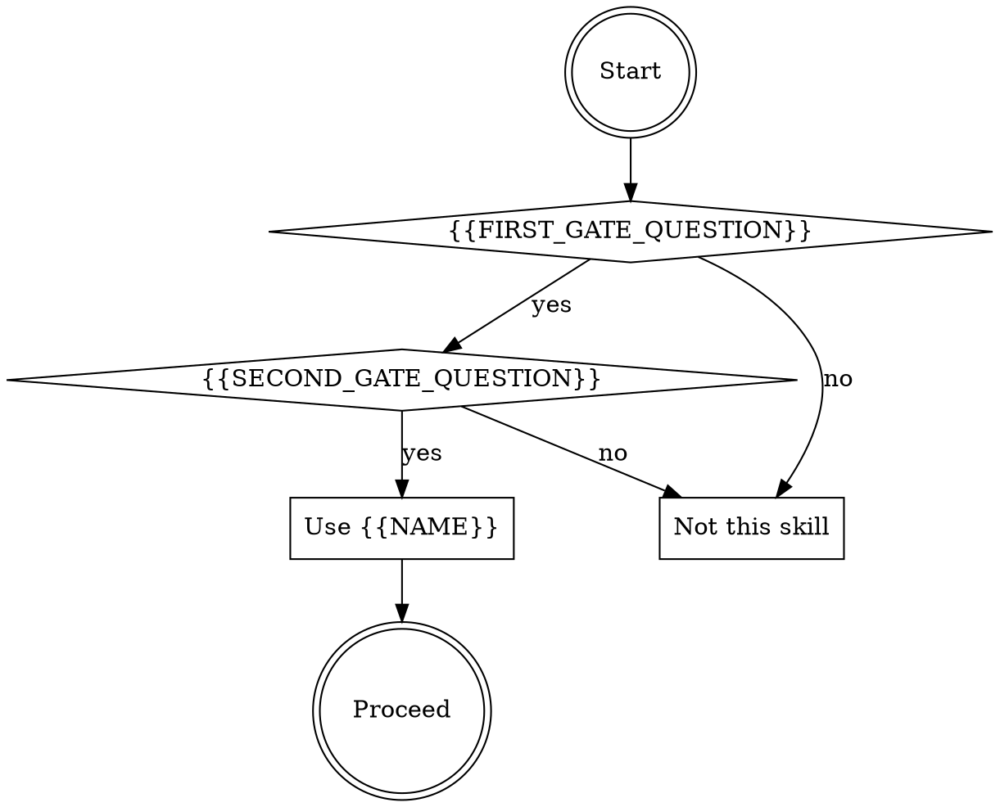
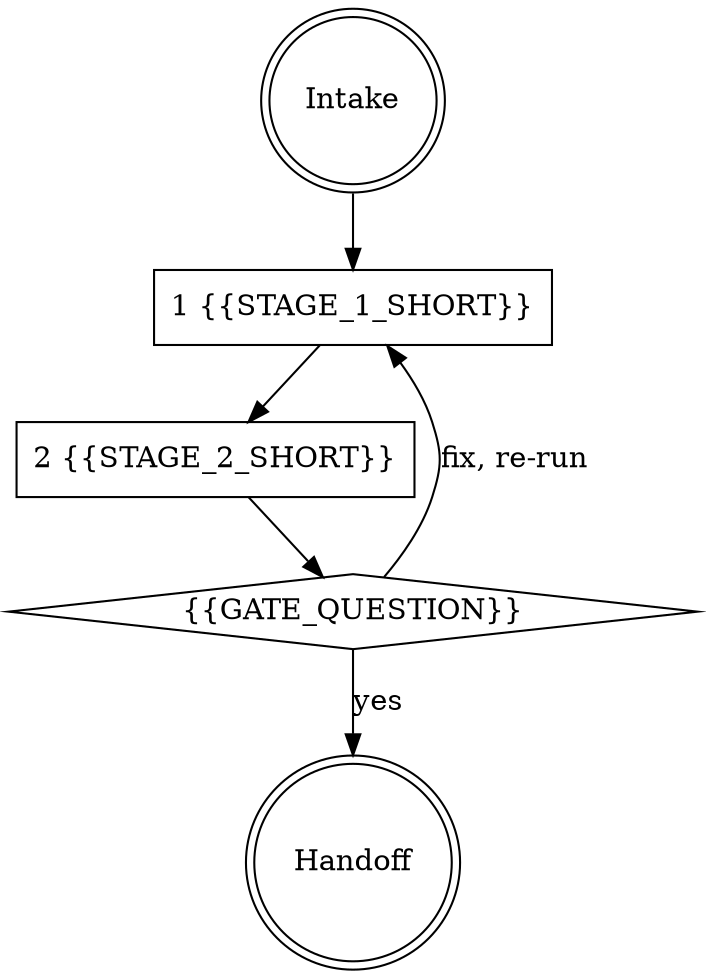

# skill-md-template — the SKILL.md skeleton

Copy everything between the START/END markers into `<skill-dir>/SKILL.md`. Fill every
`{{SLOT}}`. Delete the `<!-- … -->` instruction comments when done. Do not delete, rename,
or reorder sections — `skill_gate.py` checks for all of them, and the order is the order
agents read in.

Slot-filling rules (read before you start):

- **{{NAME}}** — lowercase letters, digits, hyphens only; MUST equal the directory name.
  Verb-first or noun-tool names work: `task-splitter`, `frontmatter-gate`, `build-from-spec`.
- **{{DESCRIPTION}}** — one paragraph, third person, MUST start with `Use when`. Content:
  the triggering situations ONLY — concrete trigger phrases in quotes, symptoms, file
  states (e.g. "when X exists but Y does not"). NEVER summarize the skill's workflow:
  agents follow a workflow summary in the description and skip the body entirely. End
  with one "Do not use for ..." clause naming the nearest tempting non-use. ≤1024 chars.
- **{{LAW_n}}** — 4 to 8 laws. Each law is: NAME IN CAPS — then 2-4 sentences of what it
  forbids/requires and WHY (the why is what stops rationalization). Order laws by how
  often the baseline violated them. Every law must trace to a `law_origins` entry in
  your forge-ledger.json. Inside the IRON LAWS block, never let a wrapped line START
  with a bare 1-2 digit number followed by a period ("8. " mid-sentence reads as a law
  number to the gate); reword or re-wrap the sentence.
- **{{BASELINE_FAILURE_SUMMARY}}** — 2-4 sentences quoting the worst of your RED
  baseline. Specific numbers and verbatim phrases beat adjectives.
- **Rationalization rows** — one row per excuse your baseline agent actually used or
  implied, plus the standard ones that fit. The Reality cell names the law it violates.
- **Red flags** — observable states ("you are doing X and Y hasn't happened"), each with
  the arrow `->` pointing at the stage to return to.
- Keep the body under 500 lines. Detail that doesn't fit goes in `references/`.

---START---
---
name: {{NAME}}
description: {{DESCRIPTION}}
---

# {{NAME}}

## Overview

<!-- 3-6 sentences: what this skill does, what artifact it produces or protects, what
engine validates it, and the documented baseline failure it exists to prevent. -->
{{OVERVIEW}}
The documented baseline failure this skill exists to prevent: {{BASELINE_FAILURE_SUMMARY}}

## When to use


<!-- Add a RESUME branch if the skill can pick up partial work, like build-from-spec. -->

## IRON LAWS

```
1. {{LAW_1}}

2. {{LAW_2}}

3. {{LAW_3}}

4. {{LAW_4}}
```
<!-- 4 minimum, 8 maximum, numbering contiguous from 1 — the gate checks all three. -->

Violating the letter of these laws is violating the spirit. "{{EXAMPLE_LETTER_DODGE}}"
is a violation.

## The loop


<!-- Mirror your real checklist stages; every diamond is an engine run or a hard check. -->

## Mandatory checklist

Announce: **"Using {{NAME}} to {{PURPOSE_SHORT}}."** Create a TodoWrite item for EACH
stage and complete them in order. Do not advance until the current stage is done.

```
0. Intake — {{STAGE_0}}

1. {{STAGE_1}}

2. {{STAGE_2}}

3. {{STAGE_3}}
```
<!-- As many stages as the work needs; each stage states its own evidence ("paste the
literal output"). The last stage is always a handoff that states what the next consumer
of the artifact needs to know. -->

## Quick reference

| Check | Rule |
|---|---|
| {{CHECK_1_ID}} | {{CHECK_1_RULE}} |
| {{CHECK_2_ID}} | {{CHECK_2_RULE}} |
<!-- One row per engine check. Then the engine invocation line: -->

`python3 scripts/{{ENGINE_FILE}} {{ENGINE_ARGS}}` — exit 0 PASS, 1 FAIL, 2 load error.
`--selftest` proves the engine refuses duds.

## Common rationalizations — STOP

| Excuse | Reality |
|---|---|
| "{{EXCUSE_1}}" | {{REALITY_1}} (IRON LAW {{N1}}). |
| "{{EXCUSE_2}}" | {{REALITY_2}} (IRON LAW {{N2}}). |
| "{{EXCUSE_3}}" | {{REALITY_3}} (IRON LAW {{N3}}). |
<!-- One row per baseline excuse, minimum 3. Quote the baseline where you can. -->

## Red flags — you are rationalizing, start over

- {{RED_FLAG_1}} -> stage {{S1}}.
- {{RED_FLAG_2}} -> stage {{S2}}.
- {{RED_FLAG_3}} -> stage {{S3}}.
<!-- Observable states, not feelings. Each points at the stage to return to. -->

## Reference files

- `scripts/{{ENGINE_FILE}}` — the fail-closed engine (`--selftest` included).
- `evals/evals.json` — RED-GREEN behavioral evals (baseline failures this skill corrects).
<!-- Plus any references/*.md you actually shipped. -->
---END---
