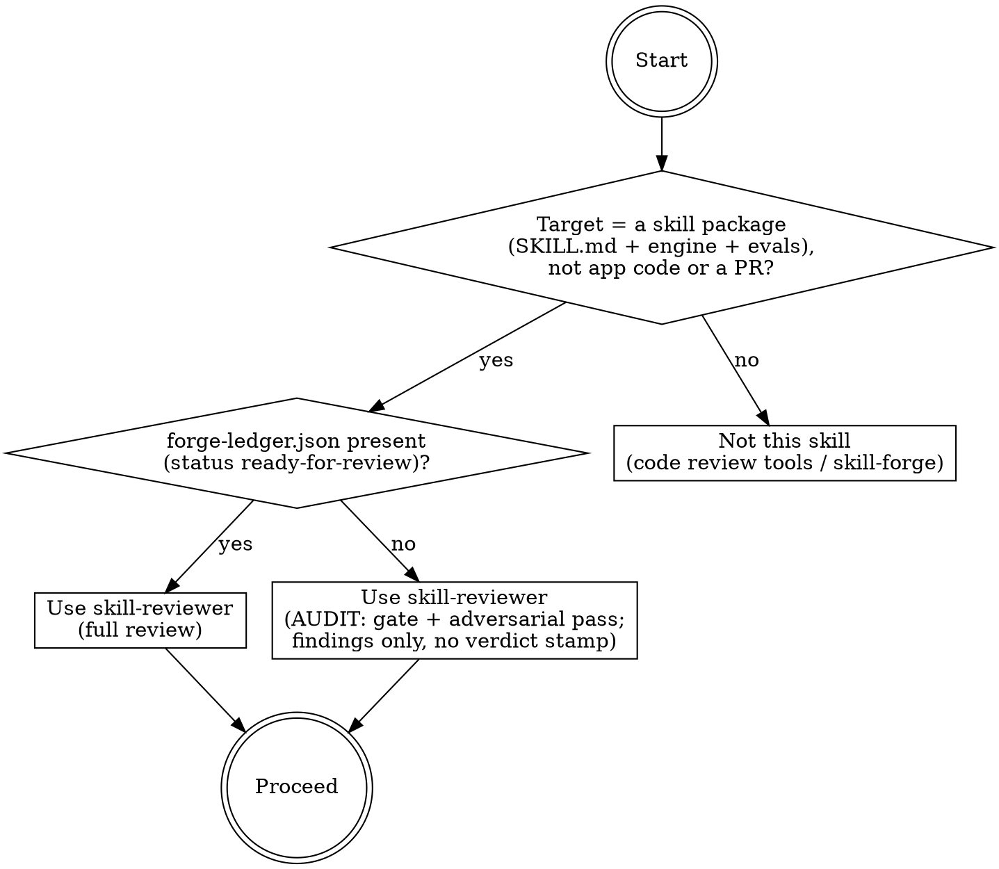
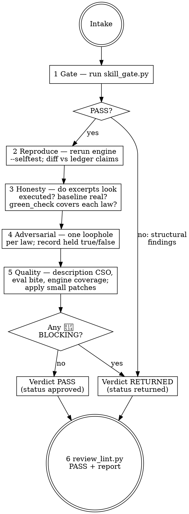

# skill-reviewer

## Overview

Final quality gate for skill packages built with skill-forge. The forge (often a
cheaper model) proves structure mechanically; the reviewer (a stronger model or a
human) proves what no gate can check: that the evidence is honest, the laws survive
adversarial pressure, and the evals would actually catch violations. The reviewer
re-runs `skill_gate.py` and the package's engine itself, attempts a concrete loophole
against every IRON LAW, patches small objective defects directly, and writes a
PASS or RETURNED verdict into forge-ledger.json — validated fail-closed by
`scripts/review_lint.py`. The failure this skill exists to prevent: a plausible-looking
package whose pasted evidence was never executed, whose laws have untested loopholes,
and which ships because nobody independent ever re-ran anything.

## When to use



## IRON LAWS

```
1. GATE BEFORE JUDGMENT — run skill_gate.py on the package before reading a
   single line as a reviewer. A structural FAIL goes straight back to the
   forge as findings; prose-reviewing a broken package wastes the expensive
   model on what a script already catches.

2. RERUN, DON'T TRUST — re-execute the package's engine --selftest and the
   gate YOURSELF and paste your own outputs into the verdict. Ledger
   excerpts are claims until you reproduce them; fabricated evidence looks
   exactly like real evidence until executed.

3. ATTACK EVERY LAW — for each IRON LAW in the reviewed skill, attempt one
   concrete loophole (a realistic excuse, dodge, or letter-vs-spirit play)
   and record whether the skill's text, evals, or engine would catch it.
   A law with an untested loophole is a law agents will find it for you.

4. FINDINGS ARE OBJECTIVE, SEVERITY-TAGGED, AND FIXABLE — every finding is
   "path[:line]: <emoji> <SEVERITY>: <problem>. <fix>." with 🔴 BLOCKING,
   🟡 PATCH, or 🔵 NIT. No vibes, no "feels thin" without naming what and
   where, no finding without its fix.

5. PATCH SMALL, RETURN BIG — apply 🟡 PATCH fixes yourself only when they
   are objective and touch at most 2 files, and record each in findings.
   Design defects — wrong laws, missing engine checks, evals that test
   nothing — are 🔴 BLOCKING and go back to the forge. The reviewer never
   rewrites the skill; a rewritten skill has no author.

6. THE VERDICT IS A STAMP WITH EVIDENCE — PASS or RETURNED is written into
   forge-ledger.json review{} with your identity, your rerun outputs, your
   findings, and your per-law adversarial results — then validated by
   review_lint.py. A verbal "looks good" is not a review.
```

Violating the letter of these laws is violating the spirit. "The forge's gate output
looks legitimate, no need to re-run" or "I'll fix this one design problem myself, it's
faster" is a violation.

## The loop



## Mandatory checklist

Announce: **"Using skill-reviewer to review [skill-name]."** Create a TodoWrite item
for EACH stage and complete them in order.

```
0. Intake — locate the package and forge-ledger.json; confirm status is
   ready-for-review (or declare AUDIT mode for a legacy skill and skip the
   verdict stamp). Note the skill's laws, engine, and eval count.

1. Gate — run skill_gate.py (bundled with skill-forge) on the package and
   paste the output. FAIL: convert each gate line into a 🔴 BLOCKING
   finding, write verdict RETURNED, skip to stage 6.

2. Reproduce — run the package's engine --selftest yourself; paste output.
   Compare against the ledger's engine_selftest and self_gate excerpts.
   Any mismatch between claimed and reproduced output is 🔴 BLOCKING.

3. Evidence honesty — read the ledger stage by stage: does the baseline
   read like a real agent transcript (specific, quotable, dated) or like
   invented color? Does green_check evidence actually demonstrate each law
   being followed, or just assert it? Suspected fabrication is 🔴 BLOCKING
   and named as such.

4. Adversarial pass — for EACH IRON LAW: invent one realistic loophole and
   trace it through the skill: would the rationalization table counter it,
   would an eval catch it, would the engine refuse the artifact it
   produces? Record {law, loophole_tried, held} in review.adversarial.
   Every law that does not hold produces a 🔴 or 🟡 finding.

5. Quality pass — description: triggers only, no workflow summary, honest
   "Do not use" clause. Evals: would the asserts distinguish a violator
   from a complier, or does everything pass trivially? Engine: does every
   advertised check have a bad fixture? Apply 🟡 PATCH fixes (≤2 files,
   objective) directly and record them as findings.

6. Verdict — write review{verdict, by, findings, reran_gate,
   reran_selftest, adversarial} into forge-ledger.json; set status
   approved (PASS) or returned (RETURNED). Run scripts/review_lint.py on
   the skill dir and paste the output — it must PASS. Report the verdict,
   the findings, and (if RETURNED) exactly what the forge must redo.
```

## Quick reference

| Check | Rule |
|---|---|
| R1 shape | review block present; verdict PASS or RETURNED; findings is a list |
| R2 identity | review.by is a named reviewer — never agent/self/forge |
| R3 reruns | PASS needs your own "SKILL GATE: PASS" + "SELFTEST RESULT: PASS" excerpts |
| R4 findings | "path[:line]: <emoji> <SEVERITY>: <problem>. <fix>." — BLOCKING/PATCH/NIT |
| R5 consistency | PASS ⇒ status approved, zero BLOCKING; RETURNED ⇒ status returned, ≥1 BLOCKING |
| R6 adversarial | one loophole entry per law; a law that fell requires a finding |

`python3 scripts/review_lint.py <skill-dir>` — exit 0 PASS, 1 FAIL, 2 load error.
`--selftest` proves the lint refuses duds. The package gate is skill-forge's:
`python3 ../skill-forge/scripts/skill_gate.py <skill-dir>`.

## Common rationalizations — STOP

| Excuse | Reality |
|---|---|
| "The ledger shows the gate passing — re-running it wastes time." | Pasted output is a claim. Fabrication is indistinguishable from evidence until you execute (IRON LAW 2). |
| "The package is obviously broken; I'll review the prose anyway to be helpful." | The gate already says everything a broken package needs to hear. Return it; spend judgment where scripts can't go (IRON LAW 1). |
| "The laws look solid; I don't need to attack each one." | Untested laws are where the next agent's rationalization lives. One loophole per law, recorded (IRON LAW 3). |
| "The evals are weak — I'll rewrite the whole evals file properly." | Rewriting is authorship, not review. Weak-by-design evals are 🔴 BLOCKING; send them back (IRON LAW 5). |
| "This skill feels off but I can't point to anything." | Then it is not a finding. Locate it (path:line) or drop it (IRON LAW 4). |
| "It's 95% there — PASS with notes is kinder than RETURNED." | A PASS with known blocking defects poisons every skill built on top of it. BLOCKING forces RETURNED (IRON LAW 6). |
| "I'm the strongest model in the room; my verbal approval is enough." | Unrecorded approval is unverifiable next session. The stamp lives in the ledger and review_lint checks it (IRON LAW 6). |

## Red flags — you are rationalizing, start over

- You are reading SKILL.md prose and skill_gate.py has not run yet -> stage 1.
- Your verdict cites the ledger's selftest excerpt instead of your own rerun -> stage 2.
- review.adversarial has fewer entries than the skill has laws -> stage 4.
- A finding says "weak", "thin", or "unclear" without a path and a fix -> stage 4/5.
- You are editing 3+ files or redesigning laws "as a patch" -> stop; 🔴 BLOCKING, verdict RETURNED.
- You wrote PASS and there is a 🔴 BLOCKING finding in your own list -> stage 6; review_lint will refuse it anyway.
- The verdict exists only in your chat message, not in forge-ledger.json -> stage 6.

## Reference files

- `scripts/review_lint.py` — the verdict validator (`--selftest` included).
- `evals/evals.json` — RED-GREEN behavioral evals for the reviewer role.
- Package gate: `../skill-forge/scripts/skill_gate.py` (skill-forge owns it).
