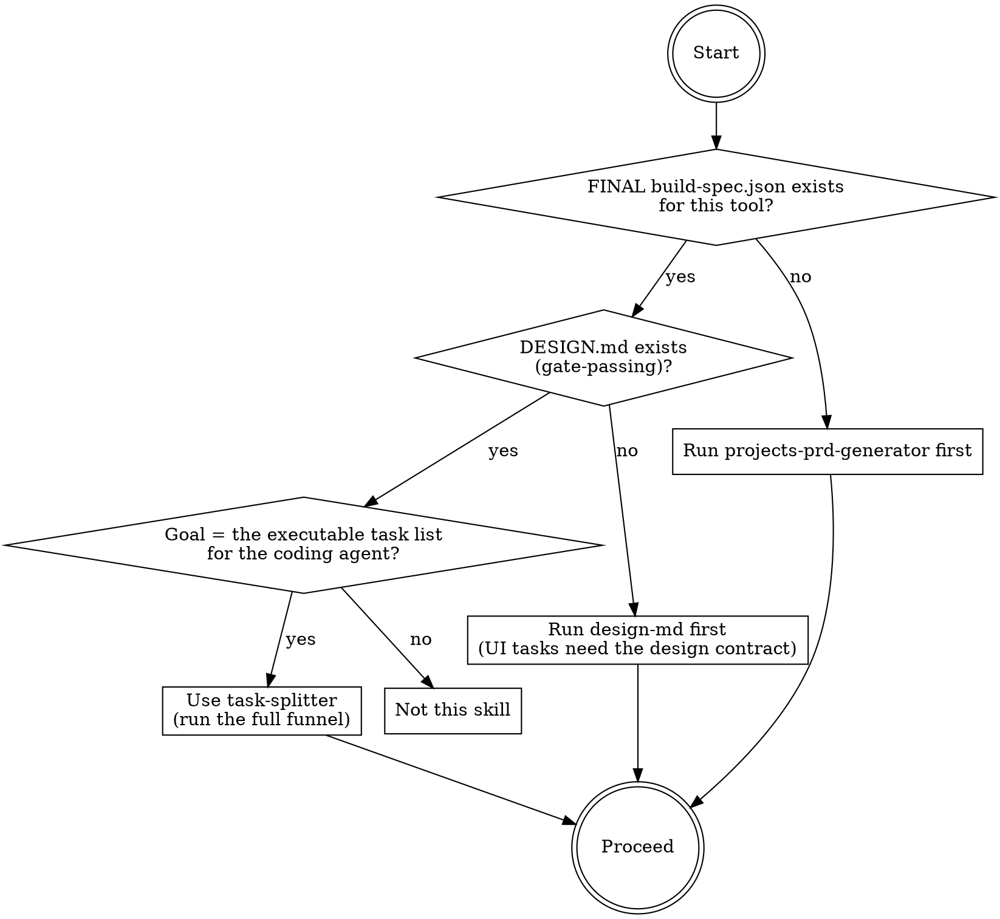
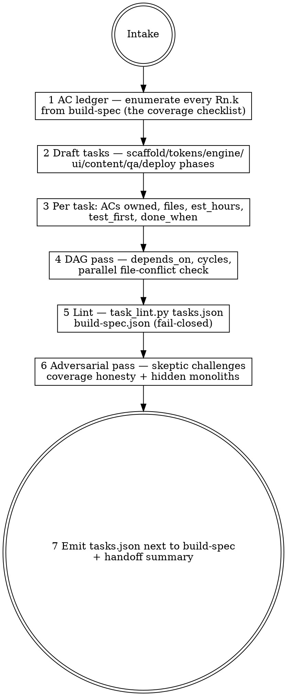

# task-splitter

## Overview

Converts a FINAL `build-spec.json` (from `projects-prd-generator`) plus the tool's `DESIGN.md`
(from `design-md`) into **`tasks.json`** — a machine-readable, dependency-ordered task DAG where
every task is 2–4 hours, owns named acceptance criteria (`Rn.k` — requirement id + 1-based AC
index), lists the files it touches, and carries its own test-first instruction. Stage 5 of the
house pipeline: pick → measure → PRD → design → **split** → build. The engine
`scripts/task_lint.py` validates fail-closed: full must-AC coverage, acyclic DAG, no file
conflicts between parallel tasks, estimates in bounds. A beautiful prose plan with "tests" as a
separate later task and dependencies in a footnote is the exact failure this skill makes
structurally impossible.

## When to use



## IRON LAWS

```
1. MACHINE-READABLE OR IT IS NOT A SPLIT — the deliverable is tasks.json
   validated by task_lint.py. A prose/markdown plan is a draft, never the
   output. If the lint cannot read it, it does not exist.

2. EVERY ACCEPTANCE CRITERION HAS AN OWNER — every AC of every must-priority
   requirement (addressed as Rn.k, 1-based index into that requirement's
   acceptance_criteria array) is claimed by >=1 task. Should-priority ACs are
   claimed too, or listed in deferred[] with a reason. Fail-closed.

3. TEST-FIRST LIVES INSIDE THE TASK — every engine/ui/wiring task carries
   test_first {test file, red_assertion}: the failing test to write BEFORE the
   implementation. A separate "write tests" task ordered after implementation
   is the documented baseline failure, not a structure.

4. THE DAG IS REAL — depends_on names existing task ids, the graph is acyclic,
   and two tasks with no dependency path between them NEVER list the same file
   (parallel-safety). Dependencies in a prose footnote do not schedule anything.

5. 2–4 HOURS OR SPLIT — est_hours <= 4 for every task; a bigger task is split
   until it fits. Monolith "wire everything" tasks hide failure until the end.

6. NOTHING OUTSIDE THE SPEC — every task traces to requirement ids, the spec's
   scope, or the DESIGN.md contract. tasks.json restates the standing
   do-not-build constraints so the executor carries them into every task.
```

Violating the letter of these laws is violating the spirit. "The dependencies are obvious from
the phase order" or "T15 wires everything, call it 4 hours" is a violation.

## The funnel



## Inputs

The tool's build folder: `build-spec.json` (requirements + acceptance_criteria arrays + scope +
budgets — the AC arrays have NO ids; address them positionally as `Rn.k`, 1-based), `DESIGN.md`
(Build Contract: components, states, ad slots, interaction budget — UI tasks cite it), the
template scaffold docs (`_template/` + SCAFFOLD.md) for the scaffold-phase tasks. REFUSE without a
FINAL build-spec; require DESIGN.md before emitting UI tasks (run `design-md` first).

## Mandatory checklist

Announce: **"Using task-splitter to split [tool] into tasks."** Create a TodoWrite item for EACH
stage and complete them in order. Do not advance until the current stage is PASS.

```
0. Intake — load build-spec + DESIGN.md + scaffold docs; confirm spec is FINAL;
   record assumptions that need user confirmation as assumptions[] (blocking
   ones stop the run).

1. AC ledger — list every requirement id, its priority, and Rn.1..Rn.k for its
   acceptance_criteria array. This is the coverage checklist stage 3 must zero.

2. Draft tasks — walk the natural build phases (scaffold -> tokens -> pure
   engine -> ui -> content -> qa gates -> close-out/deploy); one task per
   coherent 2-4h unit; kind tagged (scaffold|engine|ui|content|wiring|qa|deploy).

3. Fill each task — id, title, kind, requirements[], acceptance_criteria[]
   (Rn.k refs), files[], est_hours, done_when, test_first {required, test,
   red_assertion} (required=true for engine/ui/wiring; others may set false
   WITH a reason). Pull standing_constraints from spec wont_do + DESIGN.md
   do-not-build.

4. DAG pass — depends_on per task; verify no cycles; verify no two
   dependency-independent tasks share a file (add a dep or split the file).

5. Lint — python3 scripts/task_lint.py tasks.json build-spec.json. Paste the
   literal output. PASS required; fix and re-run, never hand-wave a violation.

6. Adversarial pass — ONE separate skeptic subagent (or a labeled self-pass if
   subagents are unavailable): (a) coverage honesty — does the owning task
   actually discharge each claimed Rn.k, or just mention it? (b) hidden
   monoliths — any task whose files+done_when imply >4h? (c) test_first
   red_assertions — would each test actually fail before the implementation?
   (d) anything with no requirement/design trace. BLOCKING = objective defect;
   fix and re-run stage 5.

7. Emit — write tasks.json NEXT TO build-spec.json. Never silently overwrite an
   existing tasks.json (write tasks-v<N>.json + note supersession). Handoff:
   task count, AC coverage count, critical path, parallel groups.
```

## Quick reference: the engine

`python3 scripts/task_lint.py tasks.json build-spec.json` — fail-closed checks:

| Check | Rule |
|---|---|
| L1 structure | JSON parses; required keys; unique task ids; kinds from the allowed set |
| L2 DAG | every depends_on resolves; graph acyclic (topo sort) |
| L3 coverage | every must AC (Rn.k) owned by >=1 task; every cited Rn.k exists and is in range; should ACs owned or in deferred[] with reason |
| L4 estimates | 0 < est_hours <= 4 per task |
| L5 test-first | engine/ui/wiring tasks: test_first.required true with non-empty test + red_assertion; other kinds may be false with non-empty reason |
| L6 files | every task lists >=1 file; no file shared by two dependency-independent tasks |
| L7 done_when | non-empty per task |

`task_lint.py --selftest` proves the engine refuses duds (golden-good + golden-bad fixtures).

## Common rationalizations — STOP

| Excuse | Reality |
|---|---|
| "The markdown plan is clearer for humans." | Humans read the handoff summary; the executor reads tasks.json. Emit both views, but the JSON is the deliverable (IRON LAW 1). |
| "Tests get their own task after the engine tasks." | That is test-AFTER — the documented baseline failure. The failing test goes INSIDE each task as test_first (IRON LAW 3). |
| "Coverage is implied — T9 is 'the R3 gate'." | Name the ACs: R3.1..R3.7 each owned by a specific task, or the lint fails you (IRON LAW 2). |
| "Dependencies are obvious from the phase numbering." | Phases don't schedule; depends_on does. The file-conflict check exists because 'obvious' parallel tasks editing one file corrupt each other (IRON LAW 4). |
| "This wiring task is big but coherent." | If files + done_when imply more than 4 hours, split it. Monoliths report 90% done forever (IRON LAW 5). |
| "Add a cleanup/polish task at the end." | Polish with no AC is scope creep. Trace it or cut it (IRON LAW 6). |
| "The lint passed, skip the skeptic." | The lint checks structure; the skeptic checks honesty — a task can cite R7.4 and not discharge it. Run stage 6. |

## Red flags — you are rationalizing, start over

- You are formatting a prose plan instead of building tasks.json -> stage 2.
- An AC ledger entry has no owning task and no deferred[] entry -> stage 3.
- Any "write tests for X" task depends on the task that implements X -> stage 3 (invert: the test goes inside).
- Two parallel tasks touch the same file -> stage 4.
- est_hours: 6 -> stage 2 (split it).
- You are about to emit without pasting the literal task_lint.py output -> stage 5.
- The skeptic was skipped because the lint passed -> stage 6.

## Reference files

- `references/tasks-template.md` — the tasks.json schema with a worked micro-example.
- `scripts/task_lint.py` — the fail-closed engine (`--selftest` included).
- `evals/evals.json` — RED-GREEN behavioral evals (baseline failures this skill corrects).
